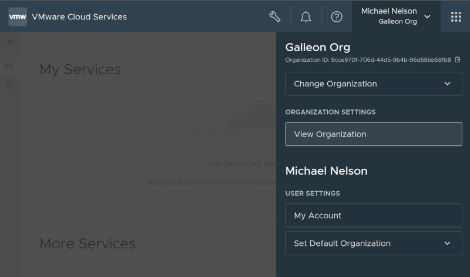

# Configuring VMware Cloud Services as an OIDC provider

This document explains how to configure VMware Cloud Services as an OIDC provider (check general information and pre-requisites for [using an OAuth2/OIDC Provider with Kubeapps](../../tutorials/using-an-OIDC-provider.md)).

> **_Note:_** there is a [more detailed guide on how to use VMware Cloud Services in this document](../../tutorials/kubeapps-on-tkg/step-1.md#step-11-configure-an-oidc-provider).

Login to VMware Cloud Services and select the organization which you want to use.

1. Select View Organization (under Organization settings of the org menu),
   
2. Click on the OAuth Apps tab,
3. Click Create App, select Web App and continue,
4. Enter a name and description for your OAuth app,
5. Add the callback URL where Kubeapps will be running (e.g. <https://my.kubeapps.example.com/oauth2/callback>),
6. Leave the rest of the options other than the OpenID checkbox, which must be checked,
7. Click Create

You will now see a dialog with the app id and secret. Click on the Download JSON option as there is other useful info in the JSON.

Your Kubernetes cluster's API server (or alternatively, your [Pinniped JWTAuthenticator](./using-an-OIDC-provider-with-pinniped.md)) will need to be configured with the following options (the production VMware cloud services issuer URL is used in the example below):

```yaml
kind: ClusterConfiguration
apiServer:
  extraArgs:
    oidc-issuer-url: https://gaz.csp-vidm-prod.com # the staging endpoint is 'https://gaz-preview.csp-vidm-prod.com'
    oidc-client-id: <your client id from above>
    oidc-username-claim: email
    oidc-groups-claim: group_names
```

Once your cluster is running, you can then deploy Kubeapps with the following additional values:

```yaml
authProxy:
  enabled: true
  provider: oidc
  clientID: <your app id>
  clientSecret: <your app secret>
  cookieSecret: <your random seed string for secure cookies>
  scope: openid email group_names
  extraFlags:
    # VMware Cloud Services has different endpoints for production and staging:
    # To use the staging endpoints, replace:
    # 'gaz.csp-vidm-prod.com' with 'gaz-preview.csp-vidm-prod.com'
    # 'console.cloud.vmware.com' with 'console-stg.cloud.vmware.com/'
    - --skip-oidc-discovery=true
    - --oidc-issuer-url=https://gaz.csp-vidm-prod.com
    - --login-url=https://console.cloud.vmware.com/csp/gateway/discovery
    - --redeem-url=https://console.cloud.vmware.com/csp/gateway/am/api/auth/token
    - --oidc-jwks-url=https://console.cloud.vmware.com/csp/gateway/am/api/auth/token-public-key?format=jwks
```

Note: VMware Cloud Services has an issuer URL specific to organizations which is required for the Kubeapps auth proxy configuration above, but if you check the [`.well-known/openid-configuration`](https://console-stg.cloud.vmware.com/csp/gateway/am/api/.well-known/openid-configuration) you will see that it identifies a different (parent) issuer, `https://gaz.csp-vidm-prod.com`.
It is for this reason that the `--skip-oidc-discovery=true` option is required above and we need to manually set each `oidc-issuer`, `login-url`, `redeem-url` and `oidc-jwks-url` instead of relying on the automatic discovery.

Once deployed, if you experience issues logging in, please refer to the [Debugging auth failures when using OIDC](./OAuth2OIDC-debugging.md) section below.
