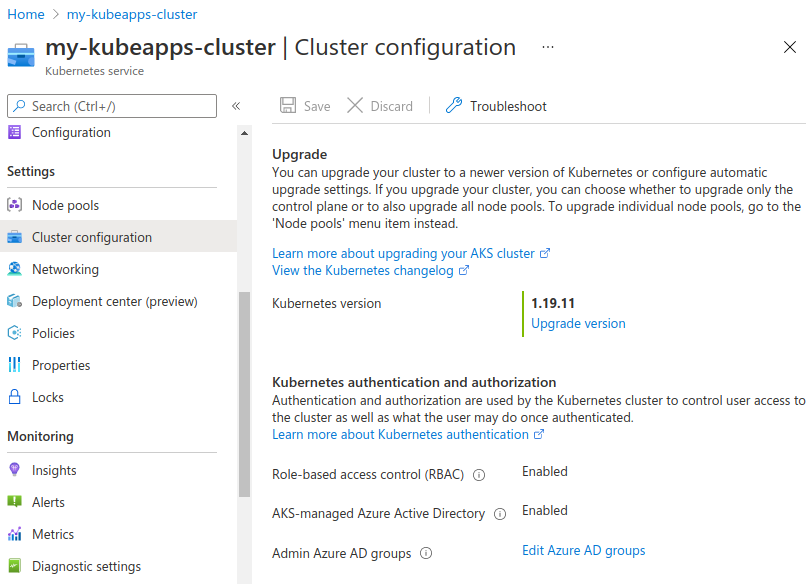
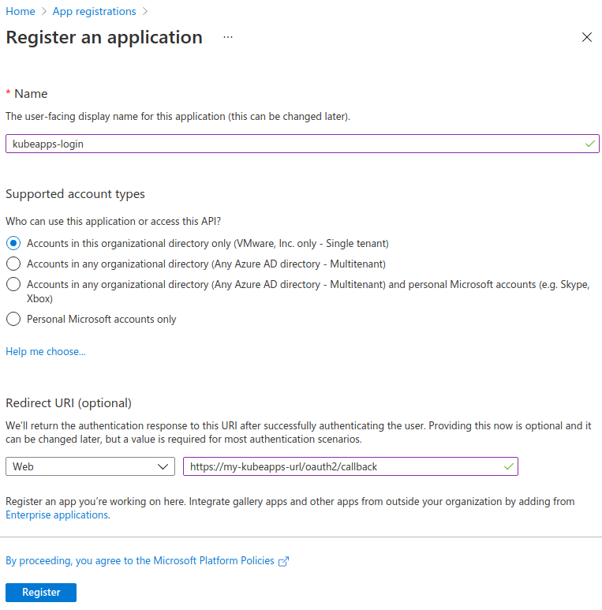
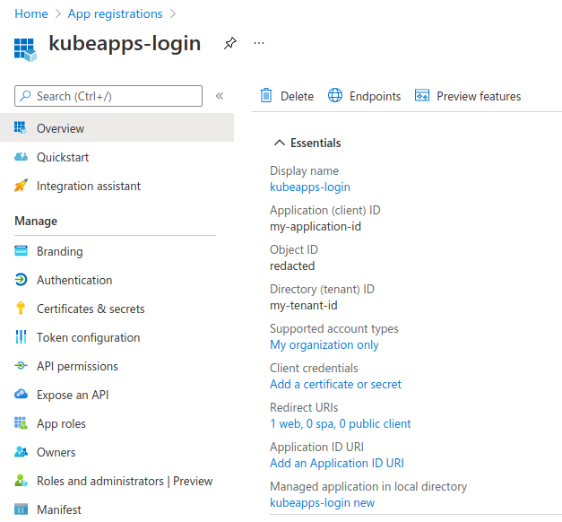
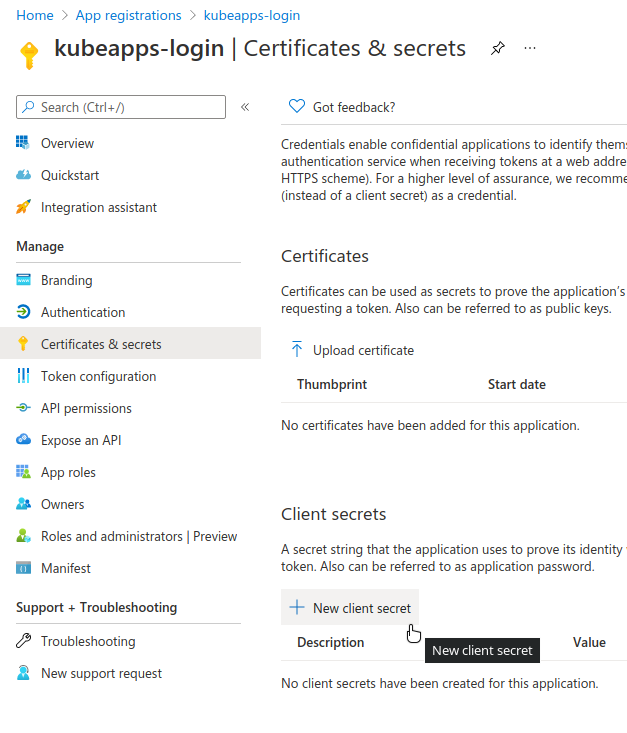
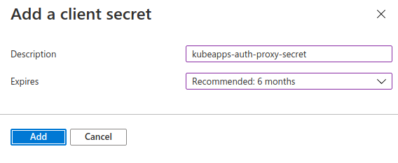
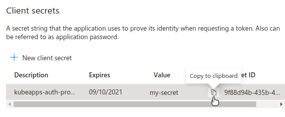
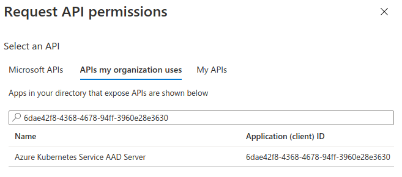
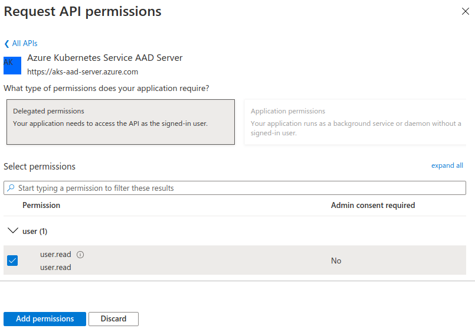
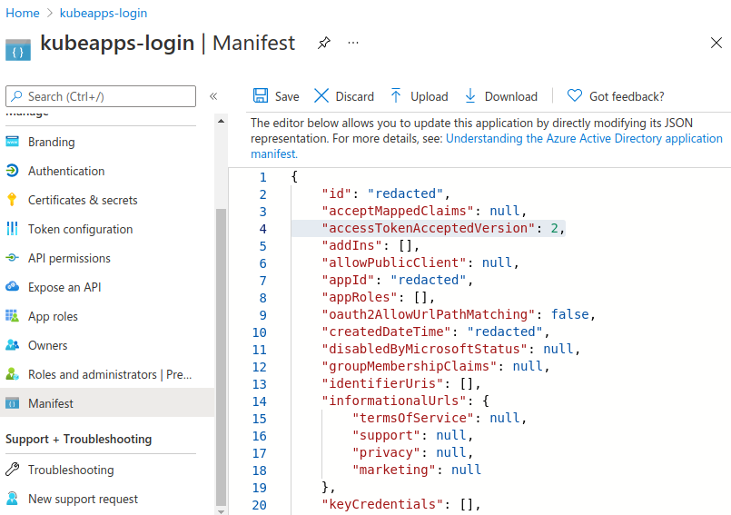

# Configuring Azure Active Directory as an OIDC provider

This document explains how to configure Azure Active Directory as an OIDC provider (check general information and pre-requisites for [using an OAuth2/OIDC Provider with Kubeapps](../../tutorials/using-an-OIDC-provider.md)).

## AKS-managed Azure Active Directory

This setup assumes that you are using the [AKS-managed Azure AD integration](https://docs.microsoft.com/en-us/azure/aks/managed-aad). Note that this is incompatible with the legacy AAD. We will use the `v2` token version instead of `v1`.

> If you really need to use `v1` tokens, please let drop us an issue and let us know your use case.

Please refer to the [official docs](https://docs.microsoft.com/en-us/azure/aks/managed-aad) in case of doubt, here we just highlight some important steps during the configuration that will be required in Kubeapps.

First, you need to verify that you have `AKS-managed Azure Active Directory: Enabled`.



Then, you have to register an Application. Go to `App registrations` and click on `Register an application`. Enter a `Name` (any name is ok) and a `Redirect URI` (it should be `https://<YOUR_KUBEAPPS_DOMAIN>/oauth2/callback` unless you have manually changed it).

> Replace `<YOUR_KUBEAPPS_DOMAIN>` with your actual Kubeapps domain. Note that you will need to use `https` instead of `http`.



Once you got your Application created, click `Overview` to see the `Application (client) ID` and the `Directory (tenant) ID`. You will need these values later.



The next step is to create a secret for the Application. Click on `Certificates & secrets` and then on `New client secret`.



Fill the `Description` and `Expires` fields according to your preferences.



Next, the `Value` of the secret will appear and you will be able to copy it. You will need this value later.



The following step is to define the permissions that the Application will need. To do so, go to `API permissions` and click `Add a permission`.


Then, in the `APIs my organization uses` enter this value `6dae42f8-4368-4678-94ff-3960e28e3630`. This is a fixed Application ID corresponding to the _Azure Kubernetes Service AAD Server_ globally provided by Azure.

> You can also get this Application ID (`6dae42f8-4368-4678-94ff-3960e28e3630`) by running `az ad sp list --display-name "Azure Kubernetes Service AAD Server"` and inspecting the `appId` value.



Next, select the `user.read` permission and click `Add permissions`.



Then, go to `Manifest` and change `accessTokenAcceptedVersion` from `null` to `2`. It will make the Application generate `v2` tokens instead of `v1`.



At the end of these steps, you will have created an application, generated a secret, granted it with `6dae42f8-4368-4678-94ff-3960e28e3630/user.read` permissions and changed the token version to `v2`. You also will have the following information:

- `Application (client) ID`, for instance, `<MY-APPLICATION-ID>`.
- `Application secret`, for instance, `<MY-SECRET>`.
- `Directory (tenant) ID`, for instance, `<MY-TENANT-ID>`.

The next step is just configuring Kubeapps to use all these values.

```yaml
frontend:
  proxypassAccessTokenAsBearer: true # required to pass the access_token instead of the id_token
authProxy:
  enabled: true
  cookieSecret: <MY-COOKIE-SECRET> # See https://oauth2-proxy.github.io/oauth2-proxy/docs/configuration/overview/#generating-a-cookie-secret
  provider: oidc
  clientID: <MY-APPLICATION-ID>
  clientSecret: <MY-SECRET>
  extraFlags:
    - --oidc-issuer-url=https://login.microsoftonline.com/<MY-TENANT-ID>/v2.0 # required for azure
    - --scope=openid email 6dae42f8-4368-4678-94ff-3960e28e3630/user.read # required for azure, exactly this string without modification
```

> Subsitute `<MY-COOKIE-SECRET>`, `<MY-APPLICATION-ID>`,`<MY-SECRET>` and `<MY-TENANT-ID>` with your values.

We highlight here:

- The issuer is `https://login.microsoftonline.com/<MY-TENANT-ID>/v2.0` (replacing `<MY-TENANT-ID>` with your own `Directory (tenant) ID`), since we are using v2 tokens.
- The scope is exactly `openid email 6dae42f8-4368-4678-94ff-3960e28e3630/user.read`.
  - Besides using the `openid` and `email` scopes, we also need `6dae42f8-4368-4678-94ff-3960e28e3630/user.read`. This one corresponds to the Application ID of the global _Azure Kubernetes Service AAD Server_. This way, you will able to get the user's email to get access to the protected resource that is AKS.

> In `v1` tokens, you had to pass this value as part of the `--resource=6dae42f8-4368-4678-94ff-3960e28e3630` flag, but in `v2` tokens, this claim is performed just using the scope.

## Azure Active Directory integration (legacy)

For setting up an Azure Kubernetes cluster (aks) with Azure Active Directory (legacy) you can follow [this guide](https://docs.microsoft.com/en-us/azure/aks/azure-ad-integration-cli). At the end of the tutorial you should have an Active Directory Application (Server). That's the Application from which we will get the needed parameters.

- Client-ID: Azure Active Directory server Application ID.
- Client-secret: A "Password" Key of the server Application.
- OIDC Issuer URL: `https://sts.windows.net/<Tenant-ID>/`. The Tenant-ID can be found at `Home > Default Directory - Properties > Directory ID`.

**Note**: If you are using an nginx reverse proxy to get to kubeapps you might need to increase the `proxy_buffer_size` as [Azure's session store is too large for nginx](https://oauth2-proxy.github.io/oauth2-proxy/docs/configuration/oauth_provider#azure-auth-provider). Similar changes might also be required for other reverse proxies.
