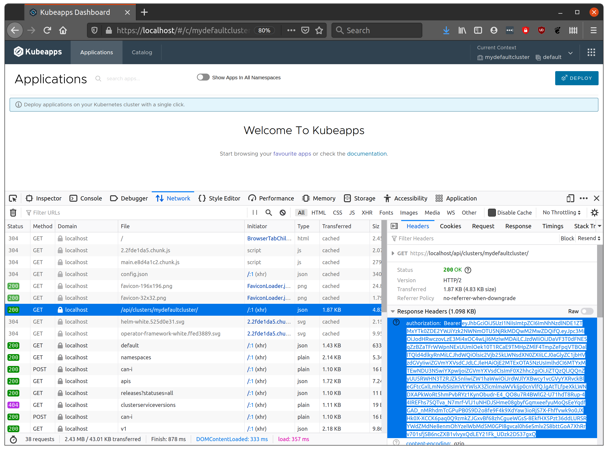

# Debugging auth failures when using OIDC

## Viewing the JWT id token

The easiest way to check the credential that is being used is to temporarily set the `--set-authorization-header=true` option for the oauth2 proxy of the kubeapps deployment.

```bash
kubectl -n kubeapps patch deployments kubeapps --type=json \
  -p '[{"op": "add", "path": "/spec/template/spec/containers/1/args/-", "value": "--set-authorization-header=true" }]'
```

Once the deployment runs a new container with the extra option, Kubeapps will then include the `id_token` that is being used to authenticate you with the Kubernetes api server in the response back to the browser.

To view the token, in your browser debugger's Network tab, watch for the request to `/api/clusters/default` or similar which will have a 40X status. Click on this request to view the headers and in the Response headers look for the `Authorization` header. The bearer token of the value will be the base64-encoded `id_token`. Copy the token as shown:



## Testing the JWT Token directly with your Kubernetes cluster

If the credential is for a real environment, you can decode it on a command line with:

```bash
export TOKEN=<paste value here>
echo $TOKEN | base64 -d
```

to check that the user and groups associated with the credential are what you expect for your Kubernetes server. If the credential is for a test environment, you can instead just paste the value into a site like `https://jwt.io` to have it decoded and neatly formatted.

If the user and group values are what you expected you can then confirm that the appropriate `RoleBinding` or `ClusterRoleBinding` is specified on your cluster.

To use the token value with a query directly to your Kubernetes api server (ie. to verify that Kubeapps isn't actually involved), you can:

```bash
curl -H "Authorization: Bearer $TOKEN" https://my.k8s.cluster/
```

You should see the same status that you saw in the browser (as Kubeapps is using the token in exactly the same way).

## Checking your Kubernetes cluster OIDC options

Once you can reproduce the issue, there are a couple of possibilities for the cause which commonly trip people up.
One common issue is that the Kubernetes cluster's api server is not configured for oidc (some people don't realise this is necessary). This is easy to check by grepping for `oidc` in the api server pod output, for example, if your cluster _is_ configured for OpenID Connect, you should see something like:

```bash
$ kubectl -n kube-system get po -l component=kube-apiserver -o yaml | grep oidc
      - --oidc-ca-file=/etc/kubernetes/pki/apiserver.crt
      - --oidc-client-id=default
      - --oidc-groups-claim=groups
      - '--oidc-groups-prefix=oidc:'
      - --oidc-issuer-url=https://172.18.0.2:32000
      - --oidc-username-claim=email
      - '--oidc-username-prefix=oidc:'
```

## Checking your OIDC prefix

Another common point of confusion is the `--oidc-username-prefix` option specified above. If it is set to a value such as `oidc:` (or using a [default value](https://kubernetes.io/docs/reference/access-authn-authz/authentication/#configuring-the-api-server) without being set explicitly), then a JWT token identifying a user of `myname@example.com` will require the RBAC RoleBinding to specify the user as `oidc:myname@example.com` to match the OIDC user with the defined RBAC.

## Checking the logs of your Kubernetes API server

Finally, if none of the above are relevant to your issue, you can check the logs of the Kubernetes API server deployment for OIDC-related lines at the time of your login attempt. These may show a configuration issue with the API server itself.

## User automatically logged out from Kubeapps Console

When using the default auth proxy, some users may experience the behavior where they are automatically logged out from the console.
Prior to the Kubeapps chart version 7.1.0, the auth proxy configuration did not include a default `--cookie-refresh` value to refresh the access/openid token and so the console will logout once the token expires. In the case of Keycloak for example, this can happen quickly as the default access token expiration is 5m.

To avoid this issue, you can do one of the following:

- upgrade the Kubeapps chart to version 7.1.0+ which sets a default of `--cookie-refresh=2m` and exposes the value in the chart values as `authProxy.cookieRefresh`.
- update Kubeapps by adding the option `--cookie-refresh=2m` to `authProxy.extraFlags`.

The duration for the refresh must be less than the access/openid expiration time configured in the OAuth2/OIDC provider.

**Note**: If you have configured a provider other than `oidc` for oauth2-proxy, the issue may still occur even after upgrading or updating Kubeapps as OAuth2 Proxy does not support cookie-refresh for all providers. See [OAuth2 Proxy Configuration Overview](https://oauth2-proxy.github.io/oauth2-proxy/docs/configuration/oauth_provider) for the list of supported providers.
