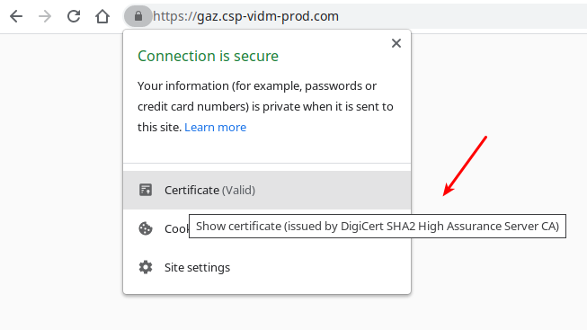

# Using an OIDC provider with Pinniped

The [Pinniped project](https://pinniped.dev/) exists to "Simplify user authentication for any Kubernetes cluster" and enables OIDC providers to be configured dynamically, rather than when a cluster is created. Kubeapps can be configured so that users must authenticate with the same OIDC provider and then authenticated requests from Kubeapps to the API server will be proxied via Pinniped, with the signed OIDC `id_token` being verified by Pinniped and exchanged for a client certificate accepted trusted by the API server.

## Installing Pinniped

Install Pinniped into a `pinniped-concierge` namespace on your cluster with:

```bash
kubectl apply -f https://get.pinniped.dev/latest/install-pinniped-concierge.yaml
```

## Configure Pinniped to trust your OIDC identity provider

Once Pinniped is running, you can add a `JWTAuthenticator` custom resource so that Pinniped knows to trust your OIDC identity provider.

> You can find additional information in this [step-by-step guide](../../tutorials/kubeapps-on-tkg/step-1.md).

```yaml
apiVersion: authentication.concierge.pinniped.dev/v1alpha1
kind: JWTAuthenticator
metadata:
  name: my-jwt-authenticator
spec:
  issuer: https://my-issuer.example.com/any/path # modify this value accordingly
  audience: my-client-id # modify this value accordingly
  claims:
    username: email
  # tls:
  # certificateAuthorityData: LS0t... # optional base64 CA data if using a self-signed certificate
```

> Have a look at [JWTAuthenticator official documentation](https://pinniped.dev/docs/howto/configure-concierge-jwt/) for further information.

As an example, here is the `JWTAuthenticator` resource used in a local development environment where the Dex OIDC identity provider is running at `https://172.18.0.2:32000` with a `default` client ID (audience).
Note that, since our local environment is using a self-signed certificate, we need to set `spec.tls.certificateAuthorityData` with the `certificate-authority-data` of the cluster.

```yaml
kind: JWTAuthenticator
apiVersion: authentication.concierge.pinniped.dev/v1alpha1
metadata:
  name: jwt-authenticator
spec:
  issuer: https://172.18.0.2:32000
  audience: default
  claims:
    groups: groups
    username: email
  tls:
    certificateAuthorityData: <removed-for-clarity>
```

> Note that in TMC, `authentication.concierge.pinniped.dev/v1alpha1` will become `authentication.concierge.pinniped.tmc.cloud.vmware.com/v1alpha1`

When the `pinniped-proxy` service of Kubeapps requests to exchange a JWT `id_token` for client certificates, Pinniped will verify the `id_token` is signed by the issuer identified here. Once verified, the claims for `username` and `groups` will be included on the generated client certificate so that the Kubernetes API server knows the username and groups associated with the request.

Note that the `spec.tls.certificateAuthorityData` field is required only if your TLS cert is signed by your own private certificate authority.

## Configuring Kubeapps to proxy requests via Pinniped

Ensure that the Kubeapps chart includes the pinniped service by enabling it in your values with:

```yaml
pinnipedProxy:
  enabled: true
```

Finally, because Kubeapps can be configured with multiple clusters, some of which may run with API servers configured with OIDC while others may be running Pinniped, your `clusters` configuration will need to identify that a specific cluster has pinniped enabled:

```yaml
clusters:
  - name: default
    pinnipedConfig:
      enabled: true
```

The [Kubeapps auth-proxy configuration](../../tutorials/using-an-OIDC-provider.md#deploying-an-auth-proxy-to-access-kubeapps) remains the same as for the standard OIDC setup so that Kubeapps knows to deploy the auth-proxy service configured to redirect to your OIDC provider.

With those changes, Kubeapps is ready to send any request for a specific cluster via Pinniped so that the OIDC `id_token` can be exchanged for client certificates accepted by the Kubernetes API server.

[Under the hood](https://pinniped.dev/posts/bringing-the-concierge-to-more-clusters/), Pinniped looks for a `kube-controller-manager` pod in the `kube-system` namespace that reads the cluster signing certificate and key and loads them into an in-memory certificate signer.

But, what if this `kube-controller-manager` is not a normal pod on a schedulable cluster node? In that scenario (usual in managed clusters, such AKS), an alternative way is required: the Pinniped impersonation proxy. Have a look at the [enabling OIDC login in managed clusters](#enabling-oidc-login-in-managed-clusters) section to know how to configure Kubeapps for using Pinniped 0.7.0 onwards on managed clusters.

### Enabling OIDC login in managed clusters

In managed clusters, such as AKS, Pinniped cannot read the cluster's certificate and key. In this case, Pinniped will have a fallback mechanism: the [impersonation proxy](https://pinniped.dev/docs/background/architecture/). It simply creates a LoadBalancer service that proxies the actual Kubernetes API. For this reason, when using Kubeapps in managed clusters using Pinniped, you'll need to use the Impersonation Proxy URL (and CA certificate) instead of the usual k8s API server URL.

Assuming you have successfully [installed Pinniped](#installing-pinniped) and configured the [JWTAuthenticator](#configure-pinniped-to-trust-your-oidc-identity-provider), you have to retrieve the Impersonation Proxy URL and CA by inspecting the `CredentialIssuer` object. To do so, you can run the following commands:

Retrieving the Impersonation Proxy URL:

```bash
kubectl get credentialissuer -o json | jq -c '.items[].status.strategies[]  | select( .type | contains("ImpersonationProxy")).frontend.impersonationProxyInfo.endpoint'
```

Retrieving the Impersonation Proxy CA:

```bash
kubectl get credentialissuer -o json | jq -c '.items[].status.strategies[]  | select( .type | contains("ImpersonationProxy")).frontend.impersonationProxyInfo.certificateAuthorityData'
```

> Alternatively, if you don't have access to the `CredentialIssuer` API object, you can still manually inspect the service and secret. For example:

```bash
kubectl get svc -n pinniped-concierge pinniped-concierge-impersonation-proxy-load-balancer -o jsonpath="{.status.loadBalancer.ingress[0].ip}"
kubectl get secret pinniped-concierge-impersonation-proxy-ca-certificate -n pinniped-concierge  -o jsonpath="{.data.ca\\.crt}"
```

Finally, use a similar `clusters` configuration:

```yaml
clusters:
  - name: your-managed-cluster
    apiServiceURL: https://... # impersonation proxy URL
    certificateAuthorityData: ... #  impersonation proxy CA
    pinnipedConfig:
      enabled: true
```

## Debugging auth failures when using OIDC

For general OIDC issues, have a look at [this OIDC debugging guide](./OAuth2OIDC-debugging.md).

### Pinniped not trusting your OIDC provider

If you are using a managed cluster (such as AKS), make sure you are using the Pinniped Impersonation Proxy in the Kubeapps configuration. Check this section to know how to [enable OIDC login in managed clusters](#enabling-oidc-login-in-managed-clusters).

If not, note that there are some scenarios (e.g., TMC) in which the installed Pinniped version is not being bundled with the usual CA certificates. As a result, common OIDC providers (e.g., Google, VMware CSP login, etc.) are not trusted by default. Consequently, Pinniped and, as a result, the authentication in Kubeapps will always fail with a 401 status code.

You can work around this issue by setting `spec.tls.certificateAuthorityData` in the `JWTAuthenticator` to match with the TLS CA used by the OIDC issuer.

#### Example (command line): using Google as the OIDC provider

For instance, if adding Google as an OIDC provider, you will have to check the CA of the `issuer` located in the [Google OIDC discovery endpoint](https://accounts.google.com/.well-known/openid-configuration):

```bash
curl -s https://accounts.google.com/.well-known/openid-configuration 2>&1 | jq '.issuer'

"https://accounts.google.com"
```

```bash
curl --insecure -vvI "https://accounts.google.com" 2>&1 | grep issuer

*  issuer: C=US; O=Google Trust Services; CN=GTS CA 1O1
```

So we need to manually add the base64 data of the certificate `Google Trust Services GTS CA 1O1`. Having a look at [this Google repository](https://pki.goog/repository/) we retrieve the `.pem` and encode the content in base64:

```bash
curl -s https://pki.goog/repo/certs/gts1o1.pem | base64

LS0tLS1CRUdJTiBDRVJUSU...
```

Next, use this `LS0tLS1CRUdJTiBDRVJUSU...` value as the `spec.tls.certificateAuthorityData` in your `JWTAuthenticator`.

#### Example (graphical): using VMware Cloud as the OIDC provider

Also, you can use your browser to check the proper CA certificate you will need. In this example, we will use the [VMware Cloud OIDC discovery endpoint](https://console.cloud.vmware.com/csp/gateway/am/api/.well-known/openid-configuration). Access this URL and retrieve the `issuer` endpoint.

```json
{
    "issuer": "https://gaz.csp-vidm-prod.com",
    ...
}
```

Next, go to `https://gaz.csp-vidm-prod.com` to check the CA certificate using your browser. For instance, in Google Chrome:



The CA used is `DigiCert SHA2 High Assurance Server CA`, so you will need to look up this certificate in the [DigiCert repository](https://www.digicert.com/kb/digicert-root-certificates.htm). Download the proper `.pem` file (in this case, [this one](https://cacerts.digicert.com/DigiCertSHA2HighAssuranceServerCA.crt.pem)) and convert the content to base64. For simplicity, we perform this step by running:

```bash
curl -s https://cacerts.digicert.com/DigiCertSHA2HighAssuranceServerCA.crt.pem | base64

LS0tLS1CRUdJTiBDRVJUSUZJQ0FURS0tLS0tCk1JS ...
```

Finally, add this output to the JWT Authenticator, as follows:

```yaml
apiVersion: authentication.concierge.pinniped.dev/v1alpha1
kind: JWTAuthenticator
metadata:
  name: jwt-authenticator
spec:
  audience: <you-client-id> # use your own client id
  claims:
    groups: groups
    username: email
  issuer: https://gaz.csp-vidm-prod.com # or https://gaz-preview.csp-vidm-prod.co
  tls:
    certificateAuthorityData: LS0tLS1CRUdJTiBDRVJUSUZJQ0FURS0tLS0tCk1JSUVzVENDQTVtZ0F3SUJBZ0lRQk9IbnBOeGM4dk50d0N0Q3VGMFZuekFOQmdrcWhraUc5dzBCQVFzRkFEQnMKTVFzd0NRWURWUVFHRXdKVlV6RVZNQk1HQTFVRUNoTU1SR2xuYVVObGNuUWdTVzVqTVJrd0Z3WURWUVFMRXhCMwpkM2N1WkdsbmFXTmxjblF1WTI5dE1Tc3dLUVlEVlFRREV5SkVhV2RwUTJWeWRDQklhV2RvSUVGemMzVnlZVzVqClpTQkZWaUJTYjI5MElFTkJNQjRYRFRFek1UQXlNakV5TURBd01Gb1hEVEk0TVRBeU1qRXlNREF3TUZvd2NERUwKTUFrR0ExVUVCaE1DVlZNeEZUQVRCZ05WQkFvVERFUnBaMmxEWlhKMElFbHVZekVaTUJjR0ExVUVDeE1RZDNkMwpMbVJwWjJsalpYSjBMbU52YlRFdk1DMEdBMVVFQXhNbVJHbG5hVU5sY25RZ1UwaEJNaUJJYVdkb0lFRnpjM1Z5CllXNWpaU0JUWlhKMlpYSWdRMEV3Z2dFaU1BMEdDU3FHU0liM0RRRUJBUVVBQTRJQkR3QXdnZ0VLQW9JQkFRQzIKNEMvQ0pBYkliUVJmMSs4S1pBYXlmU0ltWlJhdVFrQ2J6dHlmbjNZSFBzTXdWWWNadVUrVURscVVIMVZXdE1JQwpLcS9RbU80TFFOZkUwRHR5eUJTZTc1Q3hFYW11MHNpNFF6clpDd3ZWMVpYMVFLL0lIZTFObkY5WHQ0WlFhSm4xCml0clN4d1VmcUpmSjNLU3hnb1F0eHEybG5NY1pncWFGRDE1RVdDbzNqLzAxOFFzSUp6SmE5YnVMbnFTOVVkQW4KNHQwN1FqT2pCU2pFdXlqTW1xd3JJdzE0eG52bVhuRzNTajRJKzRHM0ZoYWhuU01TVGVYWGtnaXNkYVNjdXMwWApzaDVFTldWL1V5VTUwUndLbW1NYkdaSjBhQW8zd3NKU1NNczVXcUsyNFYzQjNhQWd1Q0dpa3ladkZFb2hRY2Z0CmJadnlTQy96QS9XaWFKSlRMMTdqQWdNQkFBR2pnZ0ZKTUlJQlJUQVNCZ05WSFJNQkFmOEVDREFHQVFIL0FnRUEKTUE0R0ExVWREd0VCL3dRRUF3SUJoakFkQmdOVkhTVUVGakFVQmdnckJnRUZCUWNEQVFZSUt3WUJCUVVIQXdJdwpOQVlJS3dZQkJRVUhBUUVFS0RBbU1DUUdDQ3NHQVFVRkJ6QUJoaGhvZEhSd09pOHZiMk56Y0M1a2FXZHBZMlZ5CmRDNWpiMjB3U3dZRFZSMGZCRVF3UWpCQW9ENmdQSVk2YUhSMGNEb3ZMMk55YkRRdVpHbG5hV05sY25RdVkyOXQKTDBScFoybERaWEowU0dsbmFFRnpjM1Z5WVc1alpVVldVbTl2ZEVOQkxtTnliREE5QmdOVkhTQUVOakEwTURJRwpCRlVkSUFBd0tqQW9CZ2dyQmdFRkJRY0NBUlljYUhSMGNITTZMeTkzZDNjdVpHbG5hV05sY25RdVkyOXRMME5RClV6QWRCZ05WSFE0RUZnUVVVV2ova0s4Q0IzVTh6TmxsWkdLaUVyaFpjanN3SHdZRFZSMGpCQmd3Rm9BVXNUN0QKYVFQNHYwY0IxSmdtR2dnQzcyTmtLOE13RFFZSktvWklodmNOQVFFTEJRQURnZ0VCQUJpS2xZa0Q1bTNmWFB3ZAphT3BLajRQV1VTK05hMFFXbnF4ajlkSnViSVNaaTZxQmNZUmI3VFJPc0xkNWtpbk1MWUJxOEk0ZzRYbWsvZ05ICkUrcjFoc3BaY1gzMEJKWnIwMWxZUGY3VE1TVmNHRGlFbythZmd2Mk1XNWd4VHMxNG5ocjloY3RKcXZJbmk1bHkKL0Q2cTFVRUwydFUyb2I4Y2JrZEpmMTdaU0h3RDJmMkxTYUNZSmtKQTY5YVNFYVJrQ2xkVXhQVWQxZ0plYTZ6dQp4SUNhRW5MNlZwUFgvNzh3aFFZd3Z3dC9UdjlYQlowazdZWERLL3VtZGFpc0xSYnZmWGtuc3V2Q25Rc0g2cXFGCjB3R2pJQ2hCV1VNbzBvSGpxdmJzZXp0M3RrQmlnQVZCUlFIdkZ3WSszc0F6bTJmVFlTNXloK1JwL0JJQVYwQWUKY1BVZXliUT0KLS0tLS1FTkQgQ0VSVElGSUNBVEUtLS0tLQo=
```

> Remember that `apiVersion: authentication.concierge.pinniped.dev/v1alpha1` will become `apiVersion: authentication.concierge.pinniped.tmc.cloud.vmware.com/v1alpha1` in TMC.
