# Using a Private Repository with Kubeapps

It is possible to use a private Helm repository to store your own Helm charts and deploy them using Kubeapps. In this guide we will show how you can do that with some of the solutions available right now:

- [ChartMuseum](#chartmuseum)
- [Harbor](#harbor)
- [Artifactory](#artifactory) (Pro)

But first, a note about Kubeapps AppRepository resources:

## Per Namespace Package Repositories

Previously, once an Package Repository was created in Kubeapps, the charts indexed by that repository were then available cluster-wide to all Kubeapps users. This was changed in Kubeapps 1.10 to allow creating Package Repositories that are available only in specific namespaces, which is more inline with the Kubernetes RBAC model where an account can have roles in specific namespaces. This change also enables Kubeapps to support deploying charts with images from private docker registries (more below).

A Kubeapps AppRepository can be created by anyone with the required RBAC for that namespace. If you have cluster-wide RBAC for creating AppRepositories, you can still create an Package Repository whose charts will be available to users in all namespaces by selecting "All Namespaces" when creating the repository.

To give a specific user `USERNAME` the ability to create Package Repositories in a specific namespace named `custom-namespace`, grant them both read and write RBAC for AppRepositories in that namespace:

```bash
kubectl -n custom-namespace create rolebinding username-apprepositories-read --user $USERNAME --clusterrole kubeapps:$KUBEAPPS_NAMESPACE:apprepositories-read
kubectl -n custom-namespace create rolebinding username-apprepositories-write --user $USERNAME --clusterrole kubeapps:$KUBEAPPS_NAMESPACE:apprepositories-write
```

or to allow other users the ability to deploy charts from Package Repositories in a specific namespace, grant the read access only.

## Associating docker image pull secrets to an AppRepository

When creating an AppRepository in Kubeapps, you can now additionally choose (or create) an [imagePullSecret](https://kubernetes.io/docs/concepts/containers/images/#specifying-imagepullsecrets-on-a-pod) to be associated with the AppRepository:

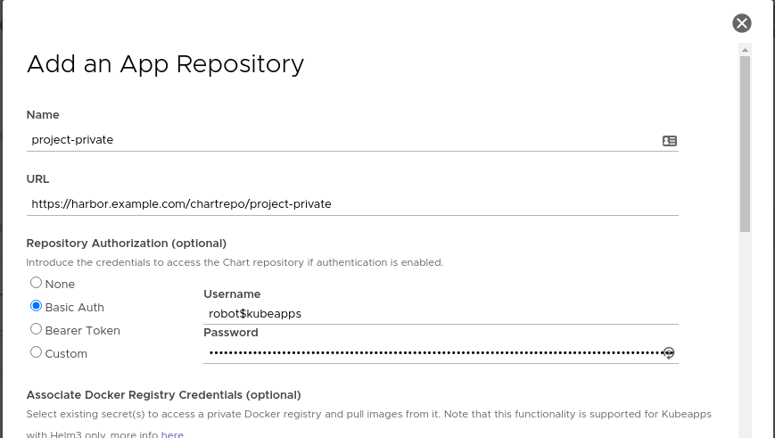
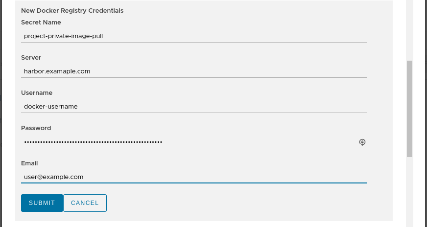

When Kubeapps deploys any chart from this AppRepository, if a referenced docker image within the chart is from a docker registry server matching one of the secrets associated with the AppRepository, then Kubeapps with Helm 3 will automatically append the corresponding imagePullSecret so that image can be pulled from the private registry. Note that the user deploying the chart will need to be able to read secrets in that namespace, which is usually the case when deploying to a namespace.

There will be further work to enable private AppRepositories to be available in multiple namespaces. Details about the design can be read on the [design document](https://docs.google.com/document/d/1YEeKC6nPLoq4oaxs9v8_UsmxrRfWxB6KCyqrh2-Q8x0/edit?ts=5e2adf87).

## Filter applications

Since Kubeapps 2.3, it's possible to limit the number of packages that Kubeapps will expose to the users of an Application Repository. For doing so, edit the filter field of the form:

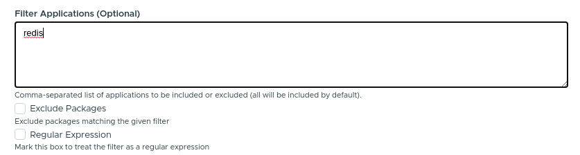

- If "Exclude Packages" is marked, all the applications matching the given names will be excluded.
- If "Regular Expression" is marked, rather than treating the input as a comma-separated list of application names, it will be treated as a [PCRE regex](https://stedolan.github.io/jq/manual/#RegularexpressionsPCRE). This can be used when the name of the application is not known or when you want to filter different applications with the same name.

### Advanced filtering

> **NOTE**: This is not supported by the Kubeapps Dashboard.

In case you want to add a custom filter, based on a metadata field different than the name, it's possible to specify a [jq](https://stedolan.github.io/jq/) query to filter applications. This is only available when manually creating the AppRepository manifest. In this example, we are filtering applications that contain "Bitnami" as one of the maintainers:

```yaml
apiVersion: kubeapps.com/v1alpha1
kind: AppRepository
metadata:
  name: my-repo
  namespace: kubeapps
spec:
  url: https://my.charts.com/
  filterRule:
    jq: .maintainers | any(.name == "Bitnami")
```

> **Caveat**: Only the latest version of the chart is evaluated.

## ChartMuseum

[ChartMuseum](https://chartmuseum.com) is an open-source Helm Chart Repository written in Go (Golang), with support for cloud storage backends, including Google Cloud Storage, Amazon S3, Microsoft Azure Blob Storage, Alibaba Cloud OSS Storage and OpenStack Object Storage.

To use ChartMuseum with Kubeapps, first deploy its Helm chart from the `stable` repository:

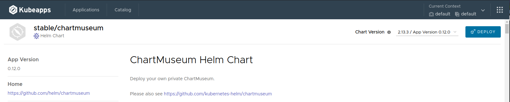

In the deployment form we should change at least two things:

- `env.open.DISABLE_API`: We should set this value to `false` so we can use the ChartMuseum API to push new charts.
- `persistence.enabled`: We will set this value to `true` to enable persistence for the charts we store. Note that this will create a [Kubernetes Persistent Volume Claim](https://kubernetes.io/docs/concepts/storage/persistent-volumes/#lifecycle-of-a-volume-and-claim) so depending on your Kubernetes provider you may need to manually allocate the required Persistent Volume to satisfy the claim. Some Kubernetes providers will automatically create PVs for you so setting this value to `true` will be enough.

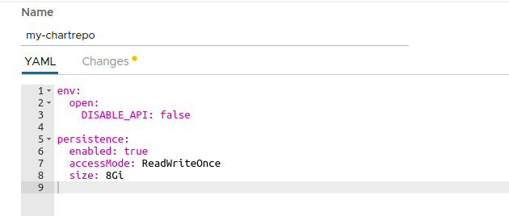

### ChartMuseum: Upload a Chart

Once ChartMuseum is deployed you will be able to upload a chart. In one terminal open a port-forward tunnel to the application:

```console
$ export POD_NAME=$(kubectl get pods --namespace default -l "app=chartmuseum" -l "release=my-chartrepo" -o jsonpath="{.items[0].metadata.name}")
$ kubectl port-forward $POD_NAME 8080:8080 --namespace default
Forwarding from 127.0.0.1:8080 -> 8080
Forwarding from [::1]:8080 -> 8080
```

And in a different terminal you can push your chart:

```console
$ helm package /path/to/my/chart
Successfully packaged chart and saved it to: /path/to/my/chart/my-chart-1.0.0.tgz
curl --data-binary "@my-chart-1.0.0.tgz" http://localhost:8080/api/charts
{"saved":true}
```

### ChartMuseum: Configure the repository in Kubeapps

To add your private repository to Kubeapps, select the Kubernetes namespace to which you want to add the repository (or "All Namespaces" if you want it available to users in all namespaces), go to `Configuration > Package Repositories` and click on "Add Package Repository". You will need to add your repository using the Kubernetes DNS name for the ChartMuseum service. This will be `<release_name>-chartmuseum.<namespace>:8080`:

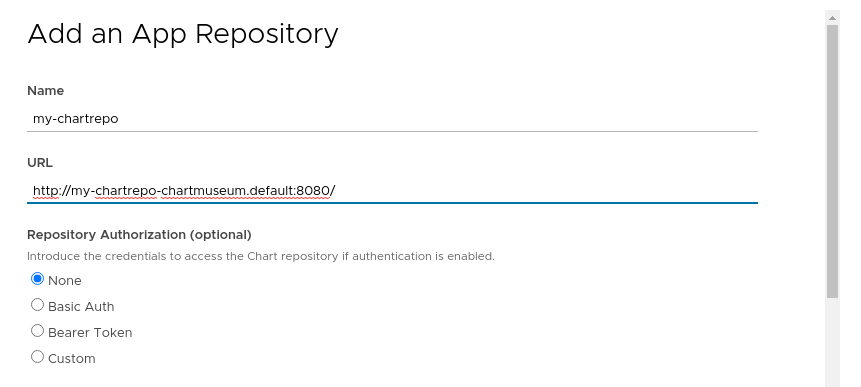

Once you create the repository you can click on the link for the specific repository and you will be able to deploy your own applications using Kubeapps.

### ChartMuseum: Authentication/Authorization

It is possible to configure ChartMuseum to use authentication with two different mechanisms:

- Using HTTP [basic authentication](https://chartmuseum.com/docs/#basic-auth) (user/password). To use this feature, it's needed to:
  - Specify the parameters `secret.AUTH_USER` and `secret.AUTH_PASS` when deploying the ChartMuseum.
  - Select `Basic Auth` when adding the repository to Kubeapps specifying that user and password.
- Using a [JWT token](https://github.com/chartmuseum/auth-server-example). Once you obtain a valid token you can select `Bearer Token` in the form and add the token in the dedicated field.

## Harbor

[Harbor](https://github.com/goharbor/harbor) is an open source trusted cloud native registry project that stores, signs, and scans content, e.g. Docker images. Harbor is hosted by the [Cloud Native Computing Foundation](https://cncf.io/). Since version 1.6.0, Harbor is a composite cloud native registry which supports both container image management and Helm chart management. Harbor integrates [ChartMuseum](https://chartmuseum.com) to provide the Helm chart repository functionality. The access to Helm Charts in a Harbor Chart Repository can be controlled via Role-Based Access Control.

To use Harbor with Kubeapps, first deploy the [Bitnami Harbor Helm Chart](https://github.com/bitnami/charts/tree/master/bitnami/harbor) from the `bitnami` repository (alternatively you can deploy Harbor using [Harbor offline installer](https://goharbor.io/docs/2.5.0/install-config/download-installer/)):

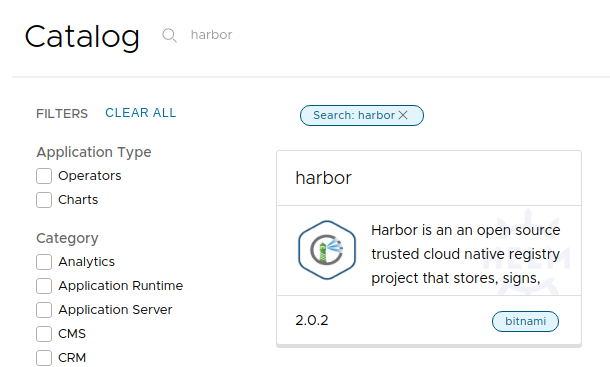

In the deployment form we should change the parameter below:

- `service.tls.enabled`: We should set this value to `false` so we don't need to configure the TLS settings. Alternatively, you can provide valid TSL certificates (check [Bitnami Harbor Helm Chart documentation](https://github.com/bitnami/charts/tree/master/bitnami/harbor#parameters) for more information).

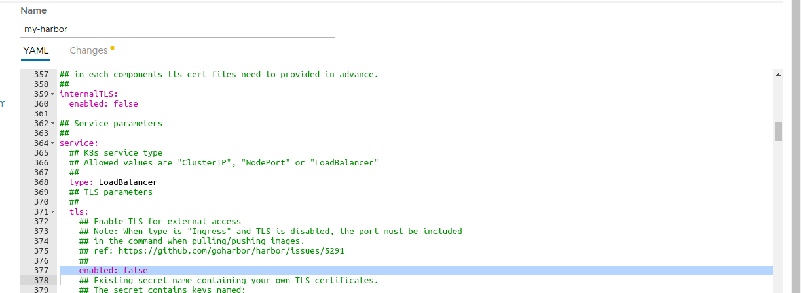

Deploy the chart and wait for it to be ready.

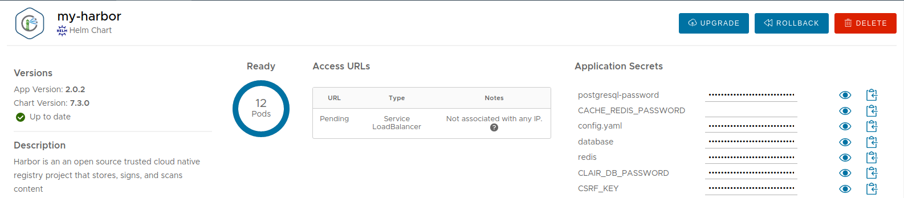

**Note**: By default, Harbor deploys ChartMuseum to store charts. If you deactivate it, you can still use the Harbor OCI registry to upload charts. Check out the [OCI](#oci-registry) section for more information.

### Harbor: Upload a Chart

First create a Helm chart package:

```console
$ helm package /path/to/my/chart
Successfully packaged chart and saved it to: /path/to/my/chart/my-chart-1.0.0.tgz
```

Second login Harbor admin portal following the instructions in the chart notes:

```console
1. Get the Harbor URL:

  echo "Harbor URL: https://127.0.0.1:8080/"
  kubectl port-forward --namespace default svc/my-harbor 8080:80 &

2. Login with the following credentials to see your Harbor application

  echo Username: "admin"
  echo Password: $(kubectl get secret --namespace default my-harbor-core-envvars -o jsonpath="{.data.HARBOR_ADMIN_PASSWORD}" | base64 --decode)
```

Create a new Project named 'my-helm-repo' with public access. Each project will serve as a Helm chart repository.

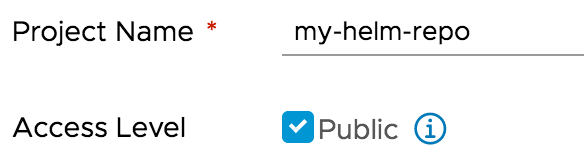

Click the project name to view the project details page, then click 'Helm Charts' tab to list all helm charts.


Click 'UPLOAD' button to upload the Helm chart you previously created. You can also use helm command to upload the chart too.

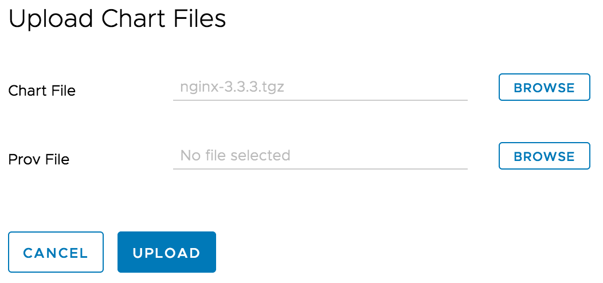

Please refer to ['Manage Helm Charts in Harbor'](https://goharbor.io/docs/2.5.0/working-with-projects/working-with-images/managing-helm-charts) for more details.

### Harbor: Configure the repository in Kubeapps

To add Harbor as the private chart repository in Kubeapps, select the Kubernetes namespace to which you want to add the repository (or "All Namespaces" if you want it available to users in all namespaces), go to `Configuration > Package Repositories` and click on "Add Package Repository" and use the Harbor helm repository URL `http://harbor.default.svc.cluster.local/chartrepo/my-helm-repo`

Once you create the repository you can click on the link for the specific repository and you will be able to deploy your own applications using Kubeapps.

### Harbor: Authentication/Authorization

It is possible to configure Harbor to use HTTP basic authentication:

- When creating a new project for serving as the helm chart repository in Harbor, set the `Access Level` of the project to non public. This enforces authentication to access the charts in the chart repository via Helm CLI or other clients.
- When `Adding Package Repository` in Kubeapps, select `Basic Auth` for `Authorization` and specify the username and password for Harbor.

## OCI Registry

Since Helm v3, the project is pushing towards the idea that using an [OCI compliant registry](https://github.com/opencontainers/distribution-spec) to store Helm charts is the future. Since Kubeapps 2.2, it's also possible to use these registries to consume Helm charts. Cloud Providers like [Amazon ECR](https://aws.amazon.com/blogs/containers/oci-artifact-support-in-amazon-ecr/), [Google Artifact Registry](https://cloud.google.com/artifact-registry/docs/supported-formats) or [Azure ACR](https://docs.microsoft.com/en-us/azure/container-registry/container-registry-image-formats) have also added support for OCI artifacts.

You can add an OCI registry like any other repository. For example, for a [Harbor registry](https://goharbor.io/docs/2.5.0/working-with-projects/working-with-images/managing-helm-charts/#manage-helm-charts-with-the-oci-compatible-registry-of-harbor):

 that the registry contains. This is because the OCI specification doesn't have an endpoint to discover artifacts (unlike the index.yaml file of a Helm repository). In any case, it's possible to use the registry provider API to retrieve this list.

For example, for Harbor, it's possible to query its API to retrieve the list:

```console
curl -X GET "https://harbor.domain/api/v2.0/projects/my-oci-registry/repositories" -H "accept: applincation/json" | jq 'map(.name) | join(", ")'
```

> **Note**: Substitute the domain `harbor.domain` and the project name `my-oci-registry` with your own.
> Also, if the repository is not public, you can use `-u username:password` to retrieve the same list.

## Artifactory

JFrog Artifactory is a Repository Manager supporting all major packaging formats, build tools and CI servers.

> **Note**: In order to use the Helm repository feature, it's necessary to use an Artifactory Pro account.

To install Artifactory with Kubeapps first add the JFrog repository to Kubeapps. Go to `Configuration > Package Repositories` and add their repository:

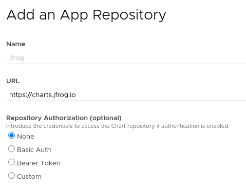

Then click on the JFrog repository and deploy Artifactory. For detailed installation instructions, check its [README](https://github.com/jfrog/charts/tree/master/stable/artifactory). If you don't have any further requirements, the default values will work.

When deployed, in the setup wizard, select "Helm" to initialize a repository:

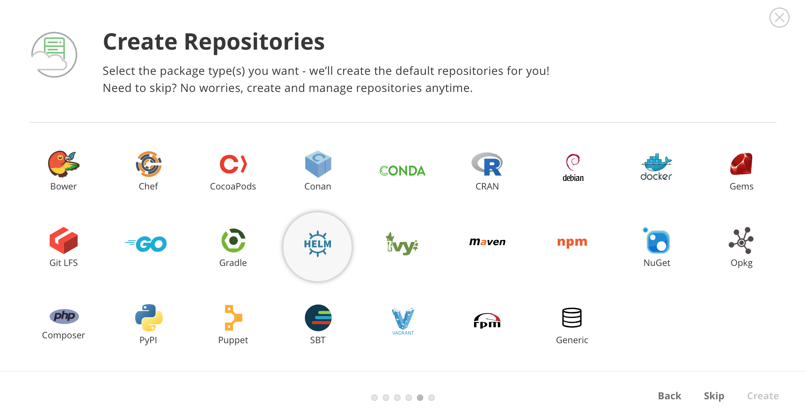

By default, Artifactory creates a chart repository called `helm`. That is the one you can use to store your applications.

### Artifactory: Upload a chart

First, you will need to obtain the user and password of the Helm repository. To do so, click on the `helm` repository and in the `Set Me Up` menu enter your password. After that you will be able to see the repository user and password.

Once you have done that, you will be able to upload a chart:

```bash
curl -u{USER}:{PASSWORD} -T /path/to/chart.tgz "http://{REPO_URL}/artifactory/helm/"
```

### Artifactory: Configure the repository in Kubeapps

To be able to access private charts with Kubeapps first you need to generate a token. You can do that with the Artifactory API:

```bash
curl -u{USER}:{PASSWORD} -XPOST "http://{REPO_URL}/artifactory/api/security/token?expires_in=0" -d "username=kubeapps" -d "scope=member-of-groups:readers"
{
  "scope" : "member-of-groups:readers api:*",
  "access_token" : "TOKEN CONTENT",
  "token_type" : "Bearer"
}
```

The above command creates a token with read-only permissions. Now you can select the namespace to which you want to add the repository (or "All Namespaces" if you want it available to users in all namespaces), go to the `Configuration > Package Repositories` menu and add your personal repository:

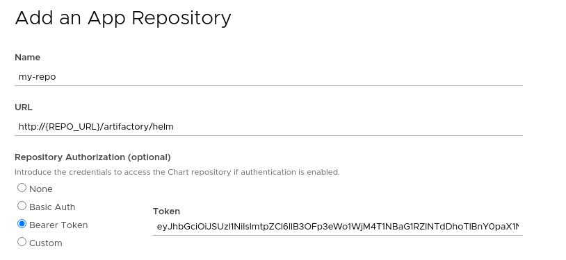

After submitting the repository, you will be able to click on the new repository and see the chart you uploaded in the previous step.

## Modifying the synchronization job

Kubeapps runs a periodic job (CronJob) to populate and synchronize the charts existing in each repository. Since Kubeapps v1.4.0, it's possible to modify the spec of this job. This is useful if you need to run the Pod in a certain Kubernetes node, or set some environment variables. To do so you can edit (or create) an AppRepository and specify the `syncJobPodTemplate` field. For example:

```yaml
apiVersion: kubeapps.com/v1alpha1
kind: AppRepository
metadata:
  name: my-repo
  namespace: kubeapps
spec:
  syncJobPodTemplate:
    metadata:
      labels:
        my-repo: "isPrivate"
    spec:
      containers:
        - env:
            - name: FOO
              value: BAR
  url: https://my.charts.com/
```

The above will generate a Pod with the label `my-repo: isPrivate` and the environment variable `FOO=BAR`.
