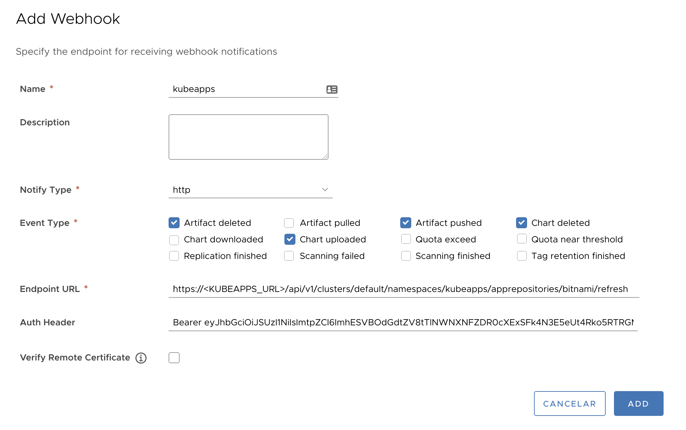

# Syncing Package Repositories using a webhook

## Introduction

Kubeapps's default configuration schedules the syncing process of the Package Repositories every _ten minutes_. However, this behavior can be easily changed globally by editing the [values.yaml file](https://github.com/vmware-tanzu/kubeapps/blob/main/chart/kubeapps/values.yaml#L908) (`crontab: "*/10 * * * *"`).

Nevertheless, this default approach might not be useful for environments with highly frequent changes. Moreover, if there are a few Package Repositories with numerous changes while others hardly are modified, therefore, increasing the default global syncing periodicity is not a good approach.

Kubeapps now supports an API endpoint for manually triggering a sync process for a given Package Repository. This endpoint is intended to be used as a webhook from external applications.
A number of platforms do use webhooks for triggering actions when something occurs. For instance, [Harbor notifies the webhook endpoint of certain events that occur in the project](https://goharbor.io/docs/2.5.0/working-with-projects/project-configuration/configure-webhooks/).
Webhook notifications provide information about events in JSON format and are usually delivered by an HTTP(s) POST to an existing webhook endpoint URL.

The example below will use Harbor for explaining how a webhook is configured for triggering an Package Repository sync process.

> In other platforms the process will be pretty similar. Doubts? Please feel free to [open an issue](https://github.com/vmware-tanzu/kubeapps/issues/new) if you need further guidance!

## Creating and granting a ServiceAccount for authenticating requests

Since the webhook endpoint will be used outside the user browser session (i.e., no OIDC login), an ad-hoc ServiceAccount should be created in the same namespace as the package repository; next, it has to be granted with sufficient permissions to `get` and `update` the `AppRepository` objects. Finally, the ServiceAccount token must be retrieved.

### Creating the RBAC objects

First, the `ServiceAccount` has to be created:

```bash
cat <<EOF | kubectl apply -f -
---
apiVersion: v1
kind: ServiceAccount
metadata:
  name: apprepositories-refresh
EOF
```

Besides, a `ClusterRole` _apprepositories-refresh_ should be already created in the cluster if the `rbac.create=true` was passed in the `values.yaml` file. Otherwise, this object is created as follows:

```bash
cat <<EOF | kubectl apply -f -
---
kind: ClusterRole
apiVersion: rbac.authorization.k8s.io/v1
metadata:
  name: apprepositories-refresh
rules:
  - apiGroups:
      - kubeapps.com
    resources:
      - apprepositories
    verbs:
      - get
      - update
EOF
```

> Note: this is only necessary if your cluster does not already have a `ClusterRole` _apprepositories-refresh_.

Next, the `ClusterRole` _apprepositories-refresh_ (with `get` and `update` permissions over `apprepositories`) has to be associated to the relevant namespace(s) by means of a `RoleBinding`:

> To bind it in multiple namespaces, create as many `RoleBinding`s (changing `namespace: my-namespace` to match your needs) for each namespace.

```bash
cat <<EOF | kubectl apply -f -
---
apiVersion: rbac.authorization.k8s.io/v1
kind: RoleBinding
metadata:
  name: apprepositories-refresh
  namespace: my-namespace
roleRef:
  apiGroup: rbac.authorization.k8s.io
  kind: ClusterRole
  name: apprepositories-refresh
subjects:
- kind: ServiceAccount
  name: apprepositories-refresh
  namespace: default
EOF
```

> Note: remember that the namespace `kubeapps` is special as every Package Repository added here is considered as a **global** one and it is shared across every namespace. Please take it into consideration before granting the ServiceAccount with permissions on the `kubeapps` namespace.

### Retrieving the ServiceAccount token

The `<TOKEN>` for the ServiceAccount _apprepositories-refresh_ is retrieved:

```bash
kubectl get secret $(kubectl get serviceaccount apprepositories-refresh -o jsonpath='{range .secrets[*]}{.name}{"\n"}{end}' | grep apprepositories-refresh) -o jsonpath='{.data.token}' -o go-template='{{.data.token | base64decode}}' && echo
```

This value will be the Bearer token to be passed in the `Authentication` HTTP header.

## Configuring a webhook in Harbor

A high-level description of the main steps is presented below; please refer to the [official Harbor documentation](https://goharbor.io/docs/2.5.0/working-with-projects/project-configuration/configure-webhooks/) for further information.

1. Log in to the Harbor interface with an account that has at least project administrator privileges.
2. Go to _Projects_, select a project, and select _Webhooks_.
3. Enter this URL: `https://<KUBEAPPS_URL>/api/v1/clusters/<CLUSTER_NAME>/namespaces/<NAMESPACE_NAME>/apprepositories/<APPREPO_NAME>/refresh`. Modify `<KUBEAPPS_URL>` , `<CLUSTER_NAME>`, `<NAMESPACE_NAME>`, `<APPREPO_NAME>` to match your needs.

   > For instance: `https://<KUBEAPPS_URL>/api/v1/clusters/default/namespaces/my-namespace/apprepositories/my-repo/refresh` will update the Package Repository `my-repo` in the namespace `my-namespace` of the cluster `default`.

4. As authentication header enter `Bearer <TOKEN>`

   > Note `<TOKEN>`is the value retrieved [before](#retrieving-the-serviceaccount-token).

5. Select as many events as you need to trigger notifications. The image below shows the common events that you would want for triggering a resync.

6. Click _Continue_ to create the webhook.

This picture illustrates the configuration of a webhook in Habor:



## Final remarks

Currently, Kubeapps does not process any payload. Therefore, the information that the platform may send as part of the `POST` request will be ignored.
Feel free to [open an issue](https://github.com/vmware-tanzu/kubeapps/issues/new) if you need further guidance or your use case is not matching with this approach.
