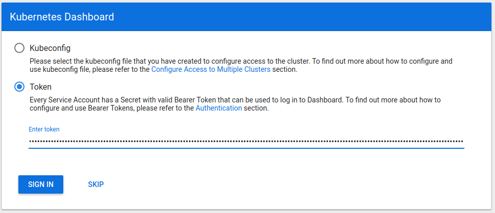
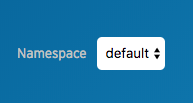

# AuthN/AuthZ in Kubeapps

## Objective

Take advantage of RBAC primitives from Kubernetes in Kubeapps to:

1. provide authenticated access to the Dashboard
1. restrict certain operations within the Dashboard for individual users

## Motivation

Consider an enterprise, MyCompany Ltd., that wants to provide Kubeapps to its employees as a means to deploy and manage applications running in a Kubernetes cluster. Kubeapps is installed into the cluster by the Cluster Operator and access is given via Kubeconfig credentials. Employees run kubeapps dashboard on their local machines to access Kubeapps.

In order to make it easier to access Kubeapps, the Cluster Operator configures Kubeapps to be externally accessible via Ingress. Now everyone is able to visit _kubeapps.mycompany.com_ to access the Kubeapps Dashboard. In order to restrict access to this external domain, the company wants to enable employees to login using their Kubernetes credentials from the user interface.

Further, the company wants to restrict the ability to manage certain applications to certain teams. They create a restricted namespace for Team A, and only allow employees in that team to view, create and manage applications within that namespace by creating the appropriate RBAC roles. However, since Kubeapps uses its own Service Account and RBAC roles to access the Kubernetes API, all employees are able to view, create and manage applications in Team A's namespace, even if their Kubeconfig credentials restrict it.

DEPRECATED: The following paragraph and parts of this document were part of the initial Kubeapps implementation, but there are serious security issue with using Kubernetes service tokens and/or Kubeconfig credentials for user login. We recommend using an auth-proxy in front of the Kubeapps frontend nginx that handles obtaining a short-lived user token via a standard single sign-on service. See [using an OIDC provider](../../tutorials/using-an-OIDC-provider.md) for more information. The remainder of the document is left in place because aside from the credentials we do take advantage of the RBAC primitives.

As described above, this is a solved problem in Kubernetes through the use of Kubeconfig credentials and RBAC roles. The Kubernetes Dashboard allows users to leverage their credentials and RBAC roles by providing a login form that accepts a bearer token. When a user is logged in with a token, all requests to the Kubernetes API are made using it. The Kubeapps Dashboard has very similar access mechanisms to the Kubernetes Dashboard, and I propose that we follow in their footsteps to enable authenticated and authorized access.

## Goals and Non-Goals

- Enable using user provided Kubernetes credentials to access Kubernetes APIs from the UI
- Leverage existing Kubernetes RBAC roles to restrict unauthorized operations, providing a mechanism to restrict operations by namespaces or type (Helm, Kubeless, Service Catalog, etc.)
- Support the ability to expose Kubeapps externally in a secure way, enabling easier access to Kubeapps without having to install the CLI
- Avoid introducing a separate way to manage access and authorization to Kubernetes resources (e.g. Kubeapps internal user database)
- Don't support every possible Kubernetes authentication provider & method

## User Stories

- As a cluster operator, I want to expose Kubeapps externally but only let authorized users perform certain operations
- As a member of one engineering team in an organization, I want the ability to deploy and manage applications within my team's namespaces, but I don't want to have access to another team's applications
- As an SRE, I want to provide my team access to view the state of running applications in the cluster, but I don't want to give out write access to create or delete applications
- As an SRE, I want to restrict access to provision more expensive service plans from the Service Catalog

## Methods of Authentication

Cluster operators have the ability to implement various strategies to authenticate with a Kubernetes cluster. The most common methods are client certificate/key and token authentication. Additionally, an authentication proxy can be used to integrate with other authentication protocols, and an authentication webhook can be used to verify bearer tokens in token authentication.

### Configuring an authentication provider on `kubeapps up`

Configuring an authentication provider is typically done by a cluster operator, and usually requires configuring the API server with flags to enable different strategies. As such, it is out of scope for Kubeapps to configure a cluster with an authentication provider.

### Logging in with Client Certificate/Key Auth

Client certificate and key pairs are a common way to authenticate against a cluster. The Kubeconfig can either point to certificates or keys in the filesystem, or they can be embedded within the file as base64 encoded strings. Unfortunately for Kubeapps, it is not possible to include a client certificate and key pair in an XMLHttpRequest (browser AJAX request), so we would not be able to leverage client certificate/key authentication within Kubeapps (see [#200](https://github.com/vmware-tanzu/kubeapps/issues/200#issuecomment-376617420)).

### Logging in with Token Auth

Bearer tokens are passed via the _Authorization_ header in an HTTP request, which makes them very easy to pass in requests from Kubeapps. In order to use Token Authentication for users, a cluster operator will need to configure the API server with a [Token Auth file](https://kubernetes.io/docs/admin/authentication/#static-token-file) that defines user-token pairs.

However, an alternative way to use token authentication is through the use of [Service Accounts](https://kubernetes.io/docs/admin/authentication/#service-account-tokens). These are typically robot accounts for use within Pods, and Kubernetes generates bearer tokens for them to authenticate with the API. Since Service Accounts are enabled by default in most Kubernetes distributions, they can provide for a good way to create and manage user access to Kubeapps. The Kubernetes Dashboard [describes using Service Accounts to create users for the Dashboard in their documentation](../../tutorials/getting-started.md).

Cluster operators can also configure clusters to use [OpenID Connect tokens to authenticate users](https://kubernetes.io/docs/admin/authentication/#openid-connect-tokens). These tokens could be retrieved from OpenID Connect providers such as Azure Active Directory, Salesforce and Google. With this method configured, the ID token returned by one of these providers can be used as a bearer token. As you can see, supporting token authentication in itself provides a plethora of different options for configuring access to Kubernetes and Kubeapps.

## User Experience

### Cluster Operator

#### Configuring Kubeapps for authentication

By default, Kubeapps should be configured for a production use-case in mind. The Service Account used for the Kubernetes API proxy will have no RBAC roles attached to it. A Cluster Operator will need to create tokens and give them to users of Kubeapps.

The Cluster Operator may want to configure the API Server to authenticate users against different providers, such as Azure Active Directory or Google. Developers accessing the cluster could then login using these providers and receive a short-lived access token to access the Kubernetes API and Kubeapps.

#### Creating new users

Given that most, if not all, Kubernetes distributions will have Service Accounts, this would be an easy way for a Cluster Operator to manage access to Kubeapps. To create a user, the Cluster Operator would create a Service Account:

```yaml
apiVersion: v1
kind: ServiceAccount
metadata:
  name: johnsmith
  namespace: kubeapps-users
```

The Service Account can be created in any namespace, the above example uses _kubeapps-users_ to isolate Service Accounts for Kubeapps users.

Then the Cluster Operator will need to create a set of RBAC roles and binding for the user. The Kubeapps documentation will need to define the set of roles for different features. For the purpose of this example, we will bind the Service Account to the _cluster-admin_ role.

```yaml
apiVersion: rbac.authorization.k8s.io/v1beta1
kind: ClusterRoleBinding
metadata:
  name: johnsmith
roleRef:
  apiGroup: rbac.authorization.k8s.io
  kind: ClusterRole
  name: cluster-admin
subjects:
  - kind: ServiceAccount
    name: johnsmith
    namespace: kubeapps-users
```

Now to retrieve the token for this account, the Cluster Operator would need to run the following:

```bash
kubectl -n kube-system describe secret $(kubectl -n kubeapps-users get secret | grep johnsmith | awk '{print $1}')
```

```yaml
Name: johnsmith-token-6gl6l
Namespace: kubeapps-users
Labels: <none>
Annotations: kubernetes.io/service-account.name=johnsmith
              kubernetes.io/service-account.uid=b16afba9-dfec-11e7-bbb9-901b0e532516
Type: kubernetes.io/service-account-token

Data
====
ca.crt: 1025 bytes
namespace: 11 bytes
token: eyJhbGciOiJSUzI1NiIsInR5cCI6IkpXVCJ9...
```

The token can then be copied and given to the developer, who can then login to Kubeapps.

### Developer

#### Accessing Kubeapps for the first time

When a developer accesses Kubeapps for the first time or on a new device, they will be greeted with a login prompt, similar to the one from the Kubernetes Dashboard shown below.



The user will need to ask their Cluster Operator for a token to access Kubeapps, and once they receive one they will be able to enter it in the login form and click "Sign In". From then on, all requests to the Kubernetes API from the dashboard will use this token.

#### Returning to Kubeapps

After logging in, the token should be persisted (e.g. in a cookie or local storage), so that we do not need to prompt the user to login when returning to the dashboard.

#### Logging out

There will need to be a "Sign Out"/"Log Out" option in the top navigation bar so that logged in users can return to the login prompt to end their session or login with a different token.

#### Namespaces

Everything the developer does inside Kubeapps will be within a Kubernetes namespace. The _default_ namespace will be used by default, and there will be a selector in the top-level navigation to select namespaces.



#### Unauthorized access

If a logged in user tries to perform an unauthorized action within Kubeapps (e.g. installing a Helm Release in a namespace they don't have access to), the UI should show a meaningful error of the failed request. In particular it should explain what RBAC roles are required for the particular operation and point to documentation on how a Cluster Operator might extend a role.

## Implementation

### Dashboard

#### Namespacing

Currently, all list views (Apps, Functions, etc.) are not scoped by a namespace. To enable the ability to list and view application resources within specific namespaces without requiring cluster-wide permissions, the Dashboard will scope all operations by a namespace by default. The current namespace will be selectable in the top navigation bar.

Kubeapps will try to fetch the list of namespaces from the API, but if this operation is not permitted (due to not having the relevant RBAC role), it will fallback to listing the namespaces in the _kubernetes_namespaces_ array stored in localStorage. By default, this will contain _default_. When in this fallback mode, there will be an option for the user to add namespaces to the _kuberetes_namespaces_ array.

It will also be possible to list resources cluster-wide by selecting the _all_ option in the namespace selector.

#### Token Authentication

The Dashboard will display a login prompt to enter a bearer token to be used for all requests to the Kubernetes API proxy. The bearer token will be stored in localStorage with the key _kubernetes_access_token_. When logging out, the _kubernetes_access_token_ in localStorage will need to be deleted. We may need to setup a singleton to expose the axios library (HTTP request library) pre-configured to fetch and include the token in the Authorization header of every request.

#### Error Handling

The Dashboard does not currently handle API errors well in all cases. With this change, there are likely to be more API errors (unauthorized errors) when certain RBAC roles are missing. With _await/async_, API errors that would normally cause promise rejections are thrown as JavaScript exceptions. It may be possible to make use of [React Error Boundaries](https://reactjs.org/blog/2017/07/26/error-handling-in-react-16.html) to catch errors within components and display an error message.

### Kubernetes API Proxy

#### Enabling external access

By default for security reasons, kubectl proxy does not accept requests from hostnames other than localhost. To enable access from a LoadBalancer IP/hostname or Ingress hostname, we will set the `--accept-hosts=.*` option when running the proxy.

This obviously raises security concerns as Kubeapps will now happily expose the whole Kubernetes API to the configured Ingress. To mitigate the attack surface of this:

1. The Service Account given to the proxy container will have no configured RBAC roles by default

2. We will configure the _--accept-paths_ option on the proxy to only expose the endpoints Kubeapps uses

3. The Kubeapps nginx-ingress Service will be configured as _ClusterIP_ by default (as it is today), a Cluster Operator will need to explicitly setup their own Ingress or switch the Service to LoadBalancer to enable access from outside the cluster - this will be documented

On top of that, documentation should encourage Cluster Operators to ensure that Kubeapps is only accessible over a private, internal network (e.g. VPN).

### Documentation

#### RBAC Roles for Kubeapps

In order for Cluster Operators to clearly and correctly assign RBAC roles to Kubeapps users, we outline the exact roles required to perform specific operations within Kubeapps. Roles that indicate a specific namespace **must** be applied within that namespace. A wildcard in the _Namespace_ column indicates that the role can be applied either to specific namespaces (recommended) or cluster-wide.

##### Applications

<table>
  <tr>
    <td>Operation</td>
    <td>API Group</td>
    <td>Namespace</td>
    <td>Resources</td>
    <td>Verbs</td>
    <td>Explanation</td>
  </tr>
  <tr>
    <td>List Applications</td>
    <td>helm.bitnami.com</td>
    <td>*</td>
    <td>helmreleases</td>
    <td>list</td>
    <td></td>
  </tr>
  <tr>
    <td></td>
    <td></td>
    <td>kubeapps</td>
    <td>configmaps</td>
    <td>list</td>
    <td>Helm (Tiller) stores release data in ConfigMaps</td>
  </tr>
  <tr>
    <td>View Application</td>
    <td>helm.bitnami.com</td>
    <td>*</td>
    <td>helmreleases</td>
    <td>get</td>
    <td></td>
  </tr>
  <tr>
    <td></td>
    <td></td>
    <td>kubeapps</td>
    <td>configmaps</td>
    <td>get</td>
    <td>Helm (Tiller) stores release data in ConfigMaps</td>
  </tr>
  <tr>
    <td>View Application Health Status</td>
    <td>apps</td>
    <td>*</td>
    <td>deployments</td>
    <td>list, watch</td>
    <td>Kubeapps watches Deployments to monitor rollout status</td>
  </tr>
  <tr>
    <td>View Application URLs</td>
    <td></td>
    <td>*</td>
    <td>services</td>
    <td>list, watch</td>
    <td>Kubeapps watches App's Services to display URLs to access the app</td>
  </tr>
  <tr>
    <td>Deploy Helm Chart</td>
    <td>helm.bitnami.com</td>
    <td>*</td>
    <td>helmreleases</td>
    <td>create</td>
    <td>Kubeapps uses the Helm CRD controller to create and manage Helm Releases</td>
  </tr>
  <tr>
    <td>Upgrade Helm Release</td>
    <td>helm.bitnami.com</td>
    <td>*</td>
    <td>helmreleases</td>
    <td>update</td>
    <td></td>
  </tr>
  <tr>
    <td>Delete Helm Release</td>
    <td>helm.bitnami.com</td>
    <td>*</td>
    <td>helmreleases</td>
    <td>delete</td>
    <td></td>
  </tr>
</table>

##### Functions

<table>
  <tr>
    <td>Operation</td>
    <td>API Group</td>
    <td>Namespace</td>
    <td>Resources</td>
    <td>Verbs</td>
    <td>Explanation</td>
  </tr>
  <tr>
    <td>List Functions</td>
    <td>kubeless.io</td>
    <td>*</td>
    <td>functions</td>
    <td>list</td>
    <td></td>
  </tr>
  <tr>
    <td>View Function</td>
    <td>kubeless.io</td>
    <td>*</td>
    <td>functions</td>
    <td>get</td>
    <td></td>
  </tr>
  <tr>
    <td>View Function Health Status</td>
    <td>apps</td>
    <td>*</td>
    <td>deployments</td>
    <td>list, watch</td>
    <td>Kubeapps watches Deployments to monitor rollout status</td>
  </tr>
  <tr>
    <td>View Function Logs</td>
    <td></td>
    <td>*</td>
    <td>pods</td>
    <td>list</td>
    <td></td>
  </tr>
  <tr>
    <td></td>
    <td></td>
    <td>*</td>
    <td>pods/logs</td>
    <td>get</td>
    <td></td>
  </tr>
  <tr>
    <td>Test Function</td>
    <td></td>
    <td>*</td>
    <td>services/proxy</td>
    <td>get,
create</td>
    <td>Send GET and POST requests to function HTTP endpoints</td>
  </tr>
  <tr>
    <td>Update Function</td>
    <td>kubeless.io</td>
    <td>*</td>
    <td>functions</td>
    <td>update</td>
    <td></td>
  </tr>
  <tr>
    <td>Delete Function</td>
    <td>kubeless.io</td>
    <td>*</td>
    <td>functions</td>
    <td>delete</td>
    <td></td>
  </tr>
  <tr>
    <td>Read ConfigMap</td>
    <td></td>
    <td>kubeless</td>
    <td>configmaps</td>
    <td>get</td>
    <td>Read Kubeless Configmap to retrieve information about the available runtimes</td>
  </tr>
</table>

##### Package Repositories

<table>
  <tr>
    <td>Operation</td>
    <td>API Group</td>
    <td>Namespace</td>
    <td>Resources</td>
    <td>Verbs</td>
    <td>Explanation</td>
  </tr>
  <tr>
    <td>List Package Repositories</td>
    <td>kubeapps.com</td>
    <td>kubeapps</td>
    <td>apprepositories</td>
    <td>list</td>
    <td></td>
  </tr>
  <tr>
    <td>View Package Repository</td>
    <td>kubeapps.com</td>
    <td>kubeapps</td>
    <td>apprepositories</td>
    <td>get</td>
    <td></td>
  </tr>
  <tr>
    <td>Resync Package Repository</td>
    <td>kubeapps.com</td>
    <td>kubeapps</td>
    <td>apprepositories</td>
    <td>update</td>
    <td></td>
  </tr>
  <tr>
    <td>Update Package Repository</td>
    <td>kubeapps.com</td>
    <td>kubeapps</td>
    <td>apprepositories</td>
    <td>update</td>
    <td></td>
  </tr>
  <tr>
    <td>Delete Package Repository</td>
    <td>kubeapps.com</td>
    <td>kubeapps</td>
    <td>apprepositories</td>
    <td>delete</td>
    <td></td>
  </tr>
</table>

##### Service Catalog

<table>
  <tr>
    <td>Operation</td>
    <td>API Group</td>
    <td>Namespace</td>
    <td>Resources</td>
    <td>Verbs</td>
    <td>Explanation</td>
  </tr>
  <tr>
    <td>List Service Brokers</td>
    <td>servicecatalog.k8s.io</td>
    <td>cluster-wide</td>
    <td>clusterservicebrokers</td>
    <td>list</td>
    <td></td>
  </tr>
  <tr>
    <td>Relist Service Broker</td>
    <td>servicecatalog.k8s.io</td>
    <td>cluster-wide</td>
    <td>clusterservicebrokers</td>
    <td>patch</td>
    <td></td>
  </tr>
  <tr>
    <td>List Service Classes</td>
    <td>servicecatalog.k8s.io</td>
    <td>cluster-wide</td>
    <td>clusterserviceclasses</td>
    <td>list</td>
    <td></td>
  </tr>
  <tr>
    <td>List Service Plans</td>
    <td>servicecatalog.k8s.io</td>
    <td>cluster-wide</td>
    <td>clusterserviceplans</td>
    <td>list</td>
    <td></td>
  </tr>
  <tr>
    <td>List Service Instances</td>
    <td>servicecatalog.k8s.io</td>
    <td>*</td>
    <td>serviceinstances</td>
    <td>list</td>
    <td></td>
  </tr>
  <tr>
    <td>View Service Instances</td>
    <td>servicecatalog.k8s.io</td>
    <td>*</td>
    <td>serviceinstances</td>
    <td>get</td>
    <td></td>
  </tr>
  <tr>
    <td>Create Service Instances</td>
    <td>servicecatalog.k8s.io</td>
    <td>*</td>
    <td>serviceinstances</td>
    <td>create</td>
    <td></td>
  </tr>
  <tr>
    <td>Delete Service Instances</td>
    <td>servicecatalog.k8s.io</td>
    <td>*</td>
    <td>servicebindings</td>
    <td>delete</td>
    <td></td>
  </tr>
  <tr>
    <td>List Service Bindings</td>
    <td>servicecatalog.k8s.io</td>
    <td>*</td>
    <td>servicebindings</td>
    <td>list</td>
    <td></td>
  </tr>
  <tr>
    <td>View Service Bindings</td>
    <td>servicecatalog.k8s.io</td>
    <td>*</td>
    <td>servicebindings</td>
    <td>get</td>
    <td></td>
  </tr>
  <tr>
    <td>View Service Binding Credentials</td>
    <td></td>
    <td>*</td>
    <td>secrets</td>
    <td>get</td>
    <td>Kubeapps can display credentials retrieved from the binding</td>
  </tr>
  <tr>
    <td>Create Service Bindings</td>
    <td>servicecatalog.k8s.io</td>
    <td>*</td>
    <td>servicebindings</td>
    <td>create</td>
    <td></td>
  </tr>
  <tr>
    <td>Delete Service Bindings</td>
    <td>servicecatalog.k8s.io</td>
    <td>*</td>
    <td>servicebindings</td>
    <td>delete</td>
    <td></td>
  </tr>
</table>

#### Externally exposing Kubeapps

We will add documentation to describe how Kubeapps can be externally exposed. There are multiple ways to achieve this:

1. Create and manage a separate Ingress resource that acts as a reverse proxy to the Kubeapps created nginx-ingress Service (**recommended**)

2. Change the nginx-ingress Service Kubeapps creates to a LoadBalancer type and get an IP address/hostname provisioned by the underlying cloud provider

3. Modify the Kubeapps created Ingress object to make use of a different Ingress controller (by configuring the _kubernetes.io/ingress.class_ annotation)

#### Providing an additional authentication layer using oauth2_proxy

We will add documentation to describe how to put something like [oauth2_proxy](https://github.com/bitly/oauth2_proxy) in front of Kubeapps to enable an additional layer of authentication/authorization. With oauth2_proxy it is possible to configure login through a company's GitHub organization, Google domain, etc.

Update: see [using an OIDC provider](../../tutorials/using-an-OIDC-provider.md) for recommended auth-proxy configuration using various providers.

## Open Questions
