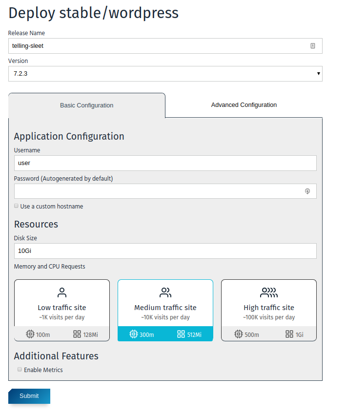
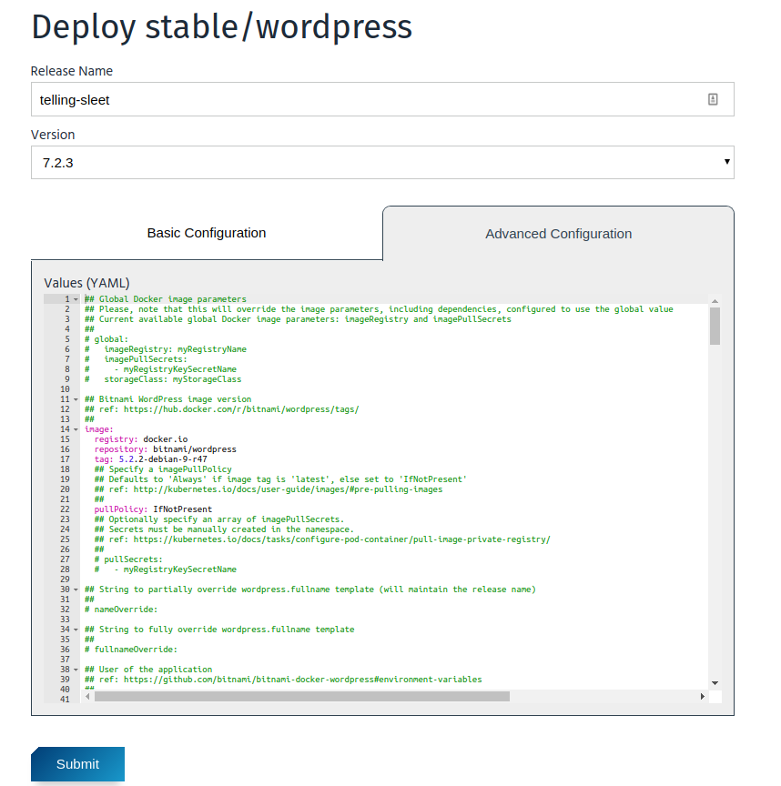

# Improving User Experience for Deploying and Upgrading Applications

The goal of this document is to specify the design proposal for improving the current approach for deploying and upgrading applications.

## Definition of the problem

When users deploy an application we present the default `values.yaml` that the chart contains. This is the only mechanism they have to modify the default behavior. In many cases, they want to modify this default setup with simple modifications like changing the default hostname or modify the default password. It's not trivial to find these settings in the values.yaml that it's usually very verbose. They should be able to modify some "common" parameters easily. In any case, for advanced users, they should be able to still modify the `values.yaml` to fine-tune the settings of the application.

Once an application is deployed, eventually the user will need to upgrade it. Now, apart from the complexity of having to handle the `values.yaml` file, it's necessary to remember the changes done in the original `values.yaml` in order to port those to the new version. In Kubeapps, once a user selects a new version, the values are substituted with the defaults for the new version, making it very difficult to modify these values with the previous one. It should be possible to follow the same approach than in the deployment: have an easy-to-fill form, having the possibility to switch to the advanced form in which they can modify the values as their liking.

## Desired User Experience (UX)

### Deployment and Upgrade Form

When users reach the deployment form, the desired behavior is to have two different views, one for the basic form and another for an advanced deployment. That can be represented as two different tabs. The basic deployment should contain all the basic parameters while the advanced form will show the information as we do today. For the first version, changes made in the basic deployment form won't affect the advanced form and viceversa. Only when the user clicks on "submit" the current form information (either basic or advanced) will be sent to the backend.

This is the proposed view for the basic deployment form:



And for the advanced tab:



\*Note that the design may vary, the final proposal will be submitted in a different PR

Once a user has deployed the application, when trying to upgrade, the basic form should be shown. The form will be pre-filled with the values of the previous version. When switching to a new version, those basic parameters should be maintained.

If the user decides to select the advanced version of the form, we should represent the existing values so the user can copy-paste them to the new version. Ideally, we could represent a git-patch view to notify the user of the changes in the previous `values.yaml` but that is out of the scope for this design.

## Basic Parameters Definition

The basic parameters that an application supports should be defined per chart. Along with the different files of the application, we should include the information of these parameters as a different file. The proposed approach is to use the file: `values.schema.json`. This file will be a [JSON Schema](https://json-schema.org/). We have chosen this approach since it's also used by Helm v3 to validate the `values.yaml` of a chart ([link](https://github.com/helm/helm/pull/5350/)). Also, it's possible to autogenerate a form from a JSON schema as we do for the service catalog instances. We won't do so for the moment because we cannot be sure that if a `values.schema.json` exists, it represent all the relevants fields of a `values.yaml`. In any case, we won't autogenerate the form to give a better experience.

This JSON Schema allows us to know the structure of the `values.yaml` file but, to know which parameters should be represented in the basic form, we need more information. In particular we need to map well known parameters, like "Disk size", to parameters in the `values.yaml`. For doing so, we can include a new label in the JSON schema. For the disk size, we will mark the parameter with `form=diskSize` so Kubeapps can recognize it. Having those two pieces of information, we are able to deliver the desired experience. See the next section for an example.

### Supported Applications and Parameters for v1

We should decide the first subset of applications and parameters that we want to support in order to deliver the first version of this feature. Based on the popularity of the charts managed by Bitnami that are installed through Kubeapps, we have selected:

1. bitnami/wordpress
2. bitnami/apache
3. bitnami/postgresql

Based on those applications, the first batch of parameters we can support is:

- Username. String. Admin username of the application.
- Password. Password. Admin password of the application.
- Email. String. Admin email of the application.
- Enable External Database. Object. Needs to be enabled. Database specifics to be used instead of built-in.
  - host: String. Database host.
  - user: String. Database user.
  - password: Password. Database password.
  - database: String. Database name.
  - port: Number. Database port.
- Enable Hostname. Object. Needs to be enabled. Hostname specifics.
  - Hostname: String. Hostname to use.
  - Enable TLS: Boolean. Needs to be enabled. Requires Cert Manager.
- Disk size. Choice. Sizes to be defined per application. Small, Medium, Large or Other. In case of Other, allows to write a custom disk size.
- Required Resources. Choice. Resources to be defined per application. Small, Medium, Large or Other. In case of Other, allows to write custom CPU an Memory requirements.
- Enable Metrics. Boolean. Use Prometheus exporter.
- Replicas. Number. Number of replicas.

Note that we should be able to represent any parameter in a generic way. We are just defining a set of well-known parameters to be able to render a richer view.

### JSON Schema Definition

Based on the above parameters, this may be an example of a JSON Schema for WordPress:

```json
{
  "$schema": "http://json-schema.org/schema#",
  "type": "object",

  "properties": {
    "wordpressUsername": {
      "type": "string",
      "title": "Username",
      "form": "username"
    },
    "wordpressPassword": {
      "type": "string",
      "title": "Password",
      "form": "password"
    },
    "wordpressEmail": { "type": "string", "title": "Email", "form": "email" },
    "mariadb": {
      "type": "object",
      "properties": {
        "enabled": { "type": "boolean", "title": "Enable External Database" }
      }
    },
    "externalDatabase": {
      "type": "object",
      "title": "External Database Details",
      "form": "externalDatabase",
      "properties": {
        "host": { "type": "string" },
        "user": { "type": "string" },
        "password": { "type": "string" },
        "database": { "type": "string" },
        "port": { "type": "integer" }
      }
    },
    "persistence": {
      "type": "object",
      "properties": {
        "size": {
          "type": "string",
          "title": "Disk Size",
          "form": "diskSize",
          "anyOf": [{ "pattern": ".*" }, { "enum": ["10Gi", "50Gi", "100Gi"] }]
        }
      }
    },
    "resources": {
      "type": "object",
      "title": "Required Resources",
      "description": "Deployment resource requests",
      "form": "resources",
      "properties": {
        "requests": {
          "type": "object",
          "properties": {
            "memory": {
              "type": "string",
              "anyOf": [
                { "pattern": ".*" },
                { "enum": ["128Mi", "512Mi", "1Gi"] }
              ]
            },
            "cpu": {
              "type": "string",
              "anyOf": [
                { "pattern": ".*" },
                { "enum": ["100m", "300m", "500m"] }
              ]
            }
          }
        }
      }
    },
    "enableMetrics": {
      "type": "boolean",
      "title": "Enable Metrics",
      "form": "enableMetrics"
    },
    "replicas": {
      "type": "integer",
      "title": "Number of Replicas",
      "form": "replicas"
    }
  },

  "required": [
    "wordpressUsername",
    "wordpressEmail",
    "persistence",
    "resources"
  ]
}
```

This `values.schema.json` is a valid JSON schema for the `values.yaml` of WordPress. It can be more detailed since it's possible to include every single parameter of the values.yaml file.

Note that in order to be able to provide a richer presentation of the form we are including the tags `form={}` with the set of well-known parameters. This allows us to know which parameters we need to represent in the form and how to map them to valid values. In case there is a parameter that is not known we should be able to parse it as a generic input.

## Deployment Workflow

This section defines how the deployment logic will work based on the JSON Schema definition above.

1. The deployment component loads the details of the Chart. If the chart doesn't contain the file `values.schema.json` or any key for `form`, continue as today; Only the advanced deployment is allowed. In other case, go to the next step.
2. Load the `values.schema.json`. From this point, two different tabs will be shown to the user. If the user changes tab from `basic` to `advanced` the new form will be shown. We will port changes from one form to the other using the YAML library: <https://github.com/eemeli/yaml/>.
3. Kubeapps will support certain types of parameters (like `username` or `resources`). If those parameters are present, we will render the rich view of the parameter, for example a card-choice instead of a text-box. For parameters not supported, we should be able to fallback to the automatic generation. This may not be possible, so in that case, the parameter will be ignored (with an error for the developer console). If a parameter has a `title` or a `description`, those should be used in the form.
4. Once the user clicks on "submit", we will also use the JSON schema to validate that the processed object complies with the definition.

## Upgrade Workflow

The upgrade workflow will be similar to the deployment with some caveats:

1. If the application to be upgraded doesn't contain a `values.schema.json` or any `form` key, behave as today. In case the current version contains that, we assume it will be included in new versions. If that's the case, go to the next step.
2. Use the current `values` (from the old version) to pre-populate the information of the form.
3. Once the user selects a new version, the new `schema` gets loaded. For parameters existing in the previous version, re-fill the form with the previous values. In case there is a new parameter in the form, leave it empty (or use its default value). If a parameter is no longer used, ignore it.
4. The logic to generate the final object and validate it is the same than for the deployment.

## Development

The amount of code/time required to implement this feature is considerably high. To avoid large PRs or temporary branches, we suggest to incrementaly implement this feature, merging changes on `main` but protecting the current status using a feature flag. If the feature flag is deactivated (default behavior), the current deployment and upgrade form will be shown. For developers (or anyone that wants to test the feature), we will enable this flag to activate the new form. We can store this flag in the Kubeapps ConfigMap. Once the feature is finished, this flag will be removed from the configuration, enabling the feature for everyone.

## Task definition

This is the list of tasks that we foresee for this feature. This list may vary depending on new findings:

- Create a values.schema.json for the desired applications.
  - WordPress
  - Apache
  - PostgreSQL
- Create a test step to ensure that if the `values.schema.json` exists, the default `values.yaml` complies with it.
- Create the feature flag.
- Use the file `values.schema.json` to verify the content of the values.yaml to submit.
- Change the current management of the `values.yaml` from text to a [YAML Document](https://eemeli.org/yaml/#documents).
- Design and create the components for the rich view, using the `form` key definition.
  - Username
  - Password
  - Email
  - Enable External Database
  - Enable Hostname
  - Enable TLS
  - Disk size
  - Required Resources
  - Enable Metrics
  - Replicas
- Design and create generic components in case the `form` key is defined with unknown parameters.
  - Text
  - Choice
- Adapt the DeploymentForm to render the basic form.
- Adapt the UpgradeForm to render the form.
- Improve the UpgradeForm to migrate values from one version to other.

## Known limitations

There will be cases in which the basic form won't be enough. For example, in the case of WordPress, the user will be able to set the resource requirements for the WordPress instance but not for the MariaDB dependency. The team managing the charts should decide, one by one, which parameters we should include and they should communicate with us in case a new `parameter` is needed.
