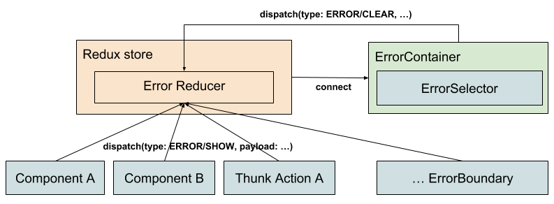

# Dashboard Error Handling

Author(s): @migmartri

Date: 2018/10/02

Type: Design Doc

Issue: [kubeapps#657](https://github.com/vmware-tanzu/kubeapps/issues/657)

## Objective

The goal of this document is to propose a consistent error handling mechanism that has an answer to two types of errors, unexpected/unhandled (transient server error, syntax error) and handled (retries, 404s, ...) in the Kubeapps frontend dashboard.

### Background

Currently, error handling is managed per-case basis, via try/catch for rendering errors or by dispatching custom Redux actions. Then, these errors are handled and shown inside those specific components.

## Overview

We want to improve the error handling of both unexpected and expected/handled errors so we can achieve:

- Unexpected errors are always handled and the user will be notified about them. They will not be masked in half-rendered or corrupted views.
- There will always be a place where errors can be shown.
- Error messages must be shown in the UI in a consistent way.
- We will have a defined API to raise errors. Converging resource specific error actions.
- Both unexpected and handled errors should be raised and shown via the same mechanism. This means that for example React Components and async Thunk Actions have a consistent way raising an error.
- Support showing more than one error. Important in our case because we rely on calling multiple API endpoints (create secret, create appRepository), in parallel for a single purpose (add new repository).

## Detailed design

### 1 - Unexpected, unhandled errors

These are the errors raised by the application at runtime. From an application logic exception to network errors while talking to an API.

Today, we are handling errors per-case basis, which is good if we want to react (pun intended) to the thrown error via a side-effect (i.e retry) or by showing actionable information to the user. But this is brittle since it force us to in advance to predict from where we can get errors from and how to handle them. Also, we need to be sure that we have a place to show these errors in every single page. **That's why, having a generic, global**catch all "Sorry something went wrong"**component can help.**

Why do we need a catch all?

Currently, if the application experiences a runtime error, the application stops rendering, but does not notify the user that something went wrong. Leaving a page in a potentially corrupted state. [This](https://github.com/vmware-tanzu/kubeapps/issues/632) is an example of such behavior.

This behavior can be confusing, so it would be better to just show the user, "something went wrong, please double check 'foo' and/or create an issue in here..."

#### Implementation details

A catch all, in theory, could be easily achieved by using React's [Error boundary](https://reactjs.org/docs/error-boundaries.html). In our case, we will wrap the render content of our `Root` or `Layout` components. If we want to allow the app to render the header and footer but wrap the dynamic content, we could do it inside the LayoutComponent, example:

Wrap the dynamic content inside the page but leaving out the header and footer.

```tsx
<main>
  <ErrorBoundary>
    <div className="container">{this.props.children}</div>
  </ErrorBoundary>
</main>
```

The way `ErrorBoundary` will work is by catching any error, in which case, it will render the existing `UnexpectedErrorAlert` component.

NOTE: ErrorBoundary does not apply on event handlers as explained [here](https://reactjs.org/docs/error-boundaries.html#how-about-event-handlers), but it is still a good addition in our case since we have quite some client side logic, i.e parsing YAML.

### 2 - Handled errors

Currently, we are doing quite a good job on the way we expose specific errors to the user in a central way. For doing so, we use a multi-purpose component called `ErrorSelector`, which is in charge of showing an error in different ways depending on its nature.

This approach is good, but it has some drawbacks:

- The error render happens in every single component that calls the `ErrorSelector`, and this means that it is easy to miss consistency.
- We require to have a error placeholder in every page, otherwise if an error is raised and captured in a page without error boundary it will not be shown.
- By design, it does not support showing multiple errors at the same time, limiting its extensibility.

#### Implementation details: Single errorContainer connected to global Redux error namespace

We can implement a single ErrorSelector component, rendered only once in the layout and connected to the Redux store. This is a example of [this pattern](https://stackoverflow.com/a/34403521).

This new store will be able to contain more than one error. This aims to support cases in which 2 async calls can return 2 errors that are both relevant. This will also allow us in the future to handle stacked errors easily by using third party libraries like [this one](https://github.com/fkhadra/react-toastify).

In our case, the implementation overview could look like something like this, more details below:



This diagram represents the state of the system after implementing "Stage 4" from our [action plan](#action-plan).

##### Components interaction (producers)

There will be two ways to interact with errors, both of them implemented using pure sync Redux actions.

1 - To show an error

Different components or Thunk Actions will be able to "raise" an error by dispatching it and some of its properties as a generic "kubeapps@ERROR/SHOW" Redux action. Some functional requirements:

- This action should contain in its payload enough properties for the ErrorSelector to be able to identify which error is and how to handle it.
- `kubeapps@ERROR/SHOW` will replace current `ERROR_APPS`, `ERROR_CATALOG`, `ERROR_CHART`, `ERROR_README`, `ERROR_REPOS` and `AUTHENTICATION_ERROR`

2 - To clear all or a single error

There needs to be a way to remove a single error from the store or all of them and hence making it/them disappear from the UI. We will do so by dispatching the `ERROR/CLEAR` action.

This error can be triggered in two scenarios.

1. When the user changes the path, we capture LOCATION_CHANGE in the errors reducer and **clear all errors**.
2. When the user click on the "close" link in the error, we **clear a single error** referenced by its ID. `{ Type: "ERROR/CLEAR", payload: { id: "errorID", } }`.

##### Reducer and store info

We will create a new reducer called `errors` which will be in charge of processing and storing application errors.

The store will be defined by following [this common](https://redux.js.org/recipes/structuringreducers/normalizingstateshape#designing-a-normalized-state) Redux denormalized pattern.

| Property | Type                                   | Description                                                    |
| -------- | -------------------------------------- | -------------------------------------------------------------- |
| byId     | `{ [errorID: string]: KubeappsError }` | It will contain a map of the Kubeapps errors indexed by its ID |
| allIds   | string[]                               | Array with the IDs of the errors.                              |

ById will be used to store the proper errors, those errors are generic Kubeapps errors with its properties. The ID will be generated during creation for example using [shortID](https://github.com/dylang/shortid).

AllIds will contain the list of identifiers and will be used to indicate ordering.

In our case, this pattern can be seen as an overkill since we will not be updating resources, but it will help us with single error deletion and to not to rely on array positioning. It also creates a precedent on how we should start thinking about mapping our stores.

##### Representational component (consumer)

Currently, our errorSelector component accepts a set of properties that then are used to decide what kind of error to show and how. This abstraction is going to still be used but instead of being passed as regular component props during render, we will retrieve them via mapStateToProps in a brand new ErrorContainer, which then will connect the existing errorSelector component.

##### ErrorBoundary integration (consumer)

In our previous section [1 - Unexpected, unhandled errors](#1---unexpected-unhandled-errors), we mentioned the use of a new ErrorBoundary wrapper that will catch any error and then render its information back to the user. This is fine as a first step, but ideally for convergence we could make this wrapper just to dispatch `error/show` and expect something else to display it (see diagram). And even a step further will be that our ErrorSelector component could become the wrapper as well by implementing componentDidCatch`.

## Caveats

- As mentioned, an errorBoundary [does not catch async errors](https://reactjs.org/docs/error-boundaries.html#how-about-event-handlers) happening in for example ThunkActions, that means that we will need to revisit our actions and be sure that we are dispatching `ERRORS/SHOW`.
- This design does not cover the feature of clearing specific errors by type of error. This can be easily supported by extending `ERROR/CLEAR` i.e `{ Type: "ERROR/CLEAR", payload: { errorType: "NotFound" } }`.

## Action plan

This design can be implemented in multiple stages:

- Stage 1: Implement error boundary for unexpected runtime rendering errors, reusing the `UnexpectedError` component. [#724](https://github.com/vmware-tanzu/kubeapps/issues/724).
- Stage 2: Implement an instance of ErrorSelector in the layout connected to the redux store, move a couple of ErrorSelector consumers to this new model [#725](https://github.com/vmware-tanzu/kubeapps/issues/725).
- Stage 3: Finish the migration of all these consumers from rendering the component to dispatch an error and remove those renders [#725](https://github.com/vmware-tanzu/kubeapps/issues/725).
- Stage 4: Change the errorBoundary component to rely on the connected errorSelector implemented in stage 2 and remove its own render [#726](https://github.com/vmware-tanzu/kubeapps/issues/726).
- Stage 5: Look into merging errorBoundary and errorSelector [#727](https://github.com/vmware-tanzu/kubeapps/issues/727).

My opinion is that in terms of priorities, what we really need in the short term is only Stage 1. The global error handling via Redux mechanism is nice to have but not strictly needed right now because the app is not growing much in terms of new views just yet.

## References

- [Global error pattern examples](https://stackoverflow.com/questions/34403269/what-is-the-best-way-to-deal-with-a-fetch-error-in-react-redux/34403521#34403521)
- [Redux state best practices](https://redux.js.org/recipes/structuringreducers/normalizingstateshape#designing-a-normalized-state)
- [React Error boundaries](https://reactjs.org/docs/error-boundaries.html)
