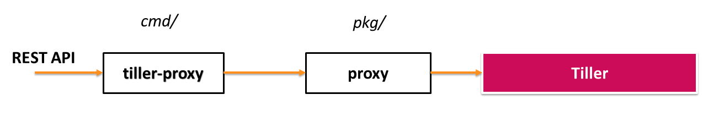
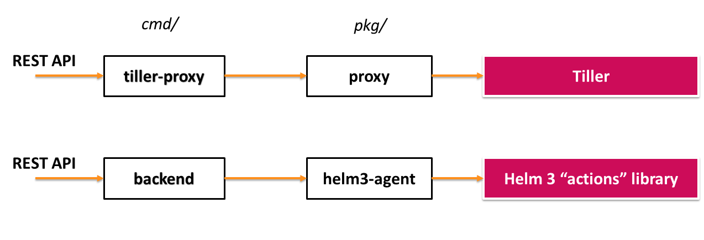

# Kubeapps Helm 3 support

We believe that the transition to Helm 3 can be done in such a fashion that both the old tiller-proxy and the new Helm 3 components can coexist, and that the Dashboard does not need to be modified.
The choice between Helm 2 support and Helm 3 support should be made at deploy time in Helm (e.g. by setting `helm3=true` in Values).

Since Helm 3 has gotten rid of Tiller, it instead provides a client library that can be used to access all required commands.
We see no reason to implement a proxy for Helm 3, but rather what we call an agent - afterall, its purpose is to perform _actions_ from the so called _Helm 3 "actions" library_.

**Current situation:**

**With the new additions:**

## Authentication

Since Helm 2 is built on the assumption that the Tiller service runs in-cluster with its own service account (and ["does not provide a way to map user credentials to specific permissions within Kubernetes"](https://v2.helm.sh/docs/securing_installation/#tiller-and-user-permissions)), the only thing Kubeapps was required to provide for authentication with Tiller (when using TLS) was the `ca.crt` file.
For this reason, Kubeapps currently (with Helm 2) authenticates with the Kubernetes API server using the user's bearer token not only when talking directly to the API server, but also to verify permissions before making any request to Tiller.

With Helm 3, all authentication will be handled by the Kubernetes API Server, so none of the above should be an issue.
Our plan is that whenever the Dashboard makes a request, we will use `InClusterConfig` to create a configuration, whose `BearerToken` we will replace with the user-specific token included in the request from the Dashboard.
