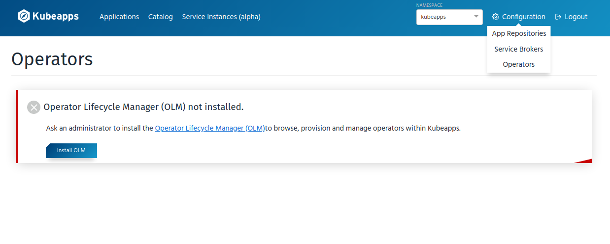
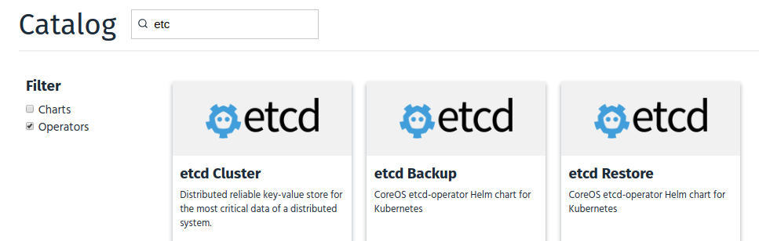
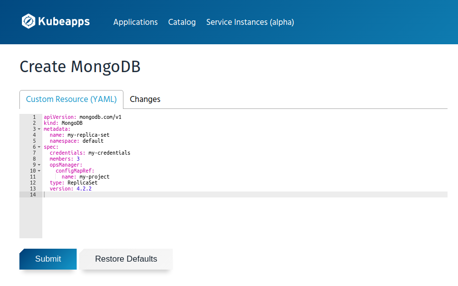
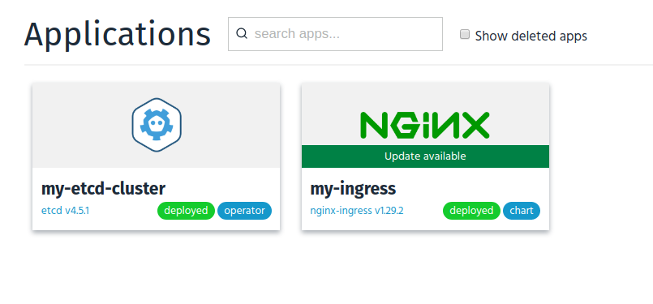

# Operators support in Kubeapps (Proof of Concept)

The goal of this document is to define the possible implementation for including [Operators](https://operatorhub.io/) in Kubeapps.

This document will describe the UX and some implementation details for a PoC for serving Operators. The goal of the PoC is to kick off the feature, detect possible issues and gather user feedback.

After the PoC, we should be able to have enough information to iterate over the solution and provide a more extensive experience.

## Operators Source of Truth

Right now, there are two places in which the community publishes open source Operators. These two places are:

- Awesome-operators: <https://github.com/operator-framework/awesome-operators>. This GitHub repository is just a README file that can be used for people to publish a link to their Operators. There are no rules to add an Operator there, simply open a PR with a link for more info and a small description.

- OperatorHub: It currently contains 110 Operators. From its page: "OperatorHub.io was launched by Red Hat in conjunction with Amazon, Microsoft, and Google forming the initial group that are supporting the initiative". It's a list of Operators more curated that leverages the [Operator Lifecycle Manager (OLM)](https://github.com/operator-framework/operator-lifecycle-manager). This is a centralized source of Operators that are more similar to what we have right now for charts. It contains metadata, icons, a standard way of installation...

Since Operators listed in the OperatorHub follow a standard and contain the required information to list and deploy them, we will use that as the source of Operators for Kubeapps. We could add a link to the awesome-operators list in the application so people can browse additional Operators.

There are two types of Operators: the ones compatible just with Openshift and the ones compatible with any Kubernetes distribution. Both lists are published in GitHub. This is the list of Operators compatible with vanilla Kubernetes distributions: <https://github.com/operator-framework/community-operators/tree/master/upstream-community-operators>

## PoC User Experience

In this section, we will define the UX for a user that explores and deploys an Operator. In order to simplify the solution, a working environment with `kubectl` will be needed.

_NOTE_: There are several steps in the management of Operators that require cluster-admin privileges. For this first implementation, we will assume that the persona using Kubeapps is a cluster administrator with admin permissions.

1. The user goes to the Configuration > Operators section. Since they don't have the OLM installed, they get an error:



2. Clicking in the "Show Instructions" buttons show the list of commands required to install the OLM:

```bash
curl -sL https://github.com/operator-framework/operator-lifecycle-manager/releases/download/0.14.1/install.sh | bash -s 0.14.1
```

4. Once the OLM has been installed, Kubeapps will show the list of Operators available in the Operator Hub. Similar to the list that can be found here: <https://operatorhub.io/>

5. When clicking in an Operator, it will display the information for the specific Operator. Again, this will be similar to the chart view and the Operator view from the hub: <https://operatorhub.io/operator/etcd>

6. When attempting to install an Operator, for this PoC, Kubeapps will just show the `kubectl` command that can be used to install it:

```bash
kubectl create -f https://operatorhub.io/install/etcd.yaml
```

_NOTE:_ Some Operators are namespaced. This means that it will be available just in one namespace.

7. After this point, Operators in a namespace will be listed. Selecting "All Namespaces" will show all the Operators in the different namespaces (showing if they are globally available or not). Clicking in one of those Operators would take the user to the Operator view (step 5).

8. Once Operators are available in a namespace, these would expose different "operator instance"s types. These are the instances that can be created using the Operator. For example, in the case of the `etcd` Operator, it will expose three different instance types: `etcd Cluster`, `etcd Backup` and `etcd Restore`. These types will be listed in the Catalog view, along with the different charts but with a tag that identifies them. Also, it should be possible to filter them to be easily discoverable:



_NOTE:_ Another option would be to create a self-contained view for the instance types catalog, similar to what Kubeapps has with Service Classes (Open Service Broker).

9. When clicking in a Operator instance type, the form to create the instance will be rendered. Here is where the user can modify the given example with any other specification:



10. Once there are Operator instances running, they will be shown in the Operators section:



11. When clicking in an Operator instance, Kubeapps will render a view similar to the application view, with information related to the instance. For the first version Kubeapps can show just the YAML used to deploy that instance.

## Implementation Design

For the PoC implementation, it's not needed to implement any backend functionality. This is because all the entities related to Operators are represented (and stored) as CRDs. This means that we can just query the different K8s API endpoints from the Dashboard and render the result.

### Checking if the OLM is available

Verifying if the OLM is installed in the cluster is quite simple. There are several resources that are only available if the OLM is installed in the cluster. For example we can check if the CRD `clusterserviceversions.operators.coreos.com` exists.

### New views

For this PoC, we would need to build the following views:

#### Operator Catalog

This is the view in which Kubeapps will list the different Operators available in the OperatorHub. The list can be built querying the resource `packagemanifests.packages.operators.coreos.com`. This is a non-namespaced resource. The list returned contains all the required information to build a card list, showing the different Operators available.

A special note for the Operator icon. There is an [APIService used to extend the Kubernetes API using the aggregation layer](https://kubernetes.io/docs/concepts/extend-kubernetes/api-extension/apiserver-aggregation/) for the resource `packages.operators.coreos.com`. This means that the API requests made to the Kubernetes API using the API group `packages.operators.coreos.com/v1` will be proxied to a service managed by the OLM. This is relevant because, to obtain the Operator icon, Kubeapps can query the following path: `apis/packages.operators.coreos.com/v1/namespaces/olm/packagemanifests/<operator>/icon` (which seems a Kubernetes endpoint but it's really an OLM service).

#### Catalog

To the current Catalog view, we need to add the list of Operators types available in the given namespace. In order to aggregate the different instance types, we would need to query all the ClusterServiceVersions (CSV) in a namespace (`clusterserviceversions.operators.coreos.com`). Each `clusterserviceversion` contains a reference to the CustomResourceDefinitions "owned" by the Operator which are the instance types that we want to show.

Again, for the icon of the instance type, we can query the logo of the Operator owning the resource.

#### Application list

To the current App list, we need to add the different instances created in a namespace. There is not a single endpoint that Kubeapps can query in order to get all the running instances (since each of them has a different group and version). Because of that, first we need the list of instance types owned by the different Operators in a namespace (already described in the previous section). Once that list is already built, we can query each of those resources for the current namespace.

#### Operator view

View with the information related to an Operator. This is all the information contained in the ClusterServiceVersion.

#### Operator Instance Deployment Form

Form needed to deploy an Operator instance. The template of the editable YAML can be retrieved from the ClusterServiceVersion that owns the Operator. There is an annotation in the resource, `alm-examples`, that contains a JSON object with different examples for the different CustomResources defined.

In any case, if there is no example for a of the resource, an empty template will be rendered.

#### Operator instance view

View showing the details of a single instance. We can elaborate this view in the future, as a first step we can just show the YAML used to deploy the instance. In the future, if the resources generated by the Operator instance contains an OwnerReference, we should be able to detect and list them in this view. At least the well known resources like Deployments, Services...
