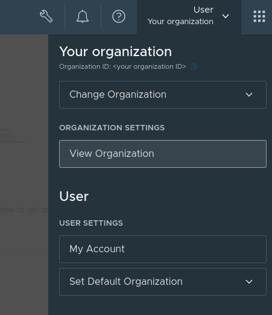
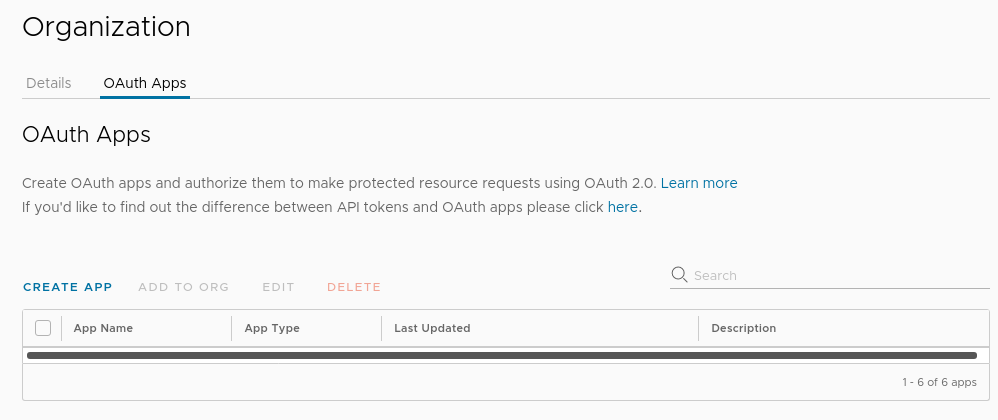
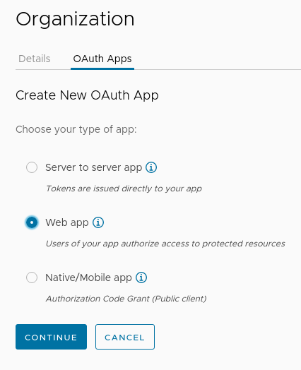
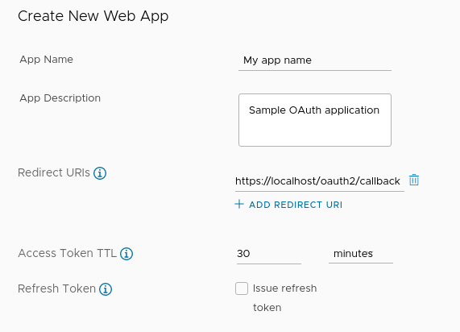
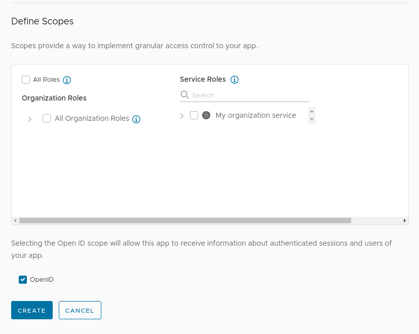
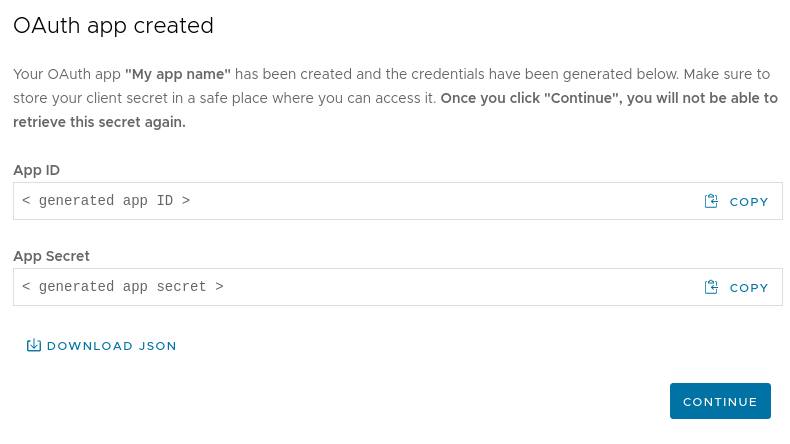

## Step 1: Configure an Identity Management Provider in the Cluster

The first step is to configure an OIDC provider ([VMware Cloud Service Portal (CSP)](https://console.cloud.vmware.com) login in this example) in the VMware Tanzu™ Kubernetes Grid™ (TKG) cluster and configure Pinniped to trust this provider for authenticating Kubernetes API calls.

### Step 1.1: Configure an OIDC Provider

TKG comes with Pinniped installed by default; you only need to configure an OIDC provider and then make Pinniped trust that OIDC provider. The OIDC provider is responsible for authenticating users in the TKG cluster and the Kubeapps dashboard. The steps below use the [VMware Cloud Services Platform (CSP)](https://console.cloud.vmware.com/) as an example; however, a similar process applies to any other OIDC-compliant provider, including Google Cloud, Azure Active Directory, Dex, Okta, and others.

> **NOTE**: You need a recent version of Kubeapps (2.3.3 onwards), otherwise, you would need to install an additional Pinniped (version 0.6.0 onwards).

> **NOTE**: If your cluster [is already attached to VMware Tanzu™ Mission Control™ (TMC)](https://docs.vmware.com/en/VMware-Tanzu-Mission-Control/services/tanzumc-getstart/GUID-F0162E40-8D47-45D7-9EA1-83B64B380F5C.html) an additional Pinniped version is automatically installed in another namespace. However, this guide will always use the Pinniped version installed by TKG (not by TMC).

#### Create an OAuth2 Application

Begin by creating an OAuth2 application to retrieve the information required by Pinniped and, later on, Kubeapps. Follow the steps below:

> **NOTE**: You must have _Developer_ access in the organization to perform these steps. Also, note that if the organization is restricted, only users belonging to this organization will be able to log in.

1. Navigate to the CSP Console at [https://console.cloud.vmware.com](https://console.cloud.vmware.com/).
2. Click the drop-down menu in the top-right corner.
3. Under the _Organization_ settings, click _View Organization_.

   

4. Click the _OAuth Apps_ tab.

   

5. Select _Web app_ and click the _Continue_ button.

   

6. Enter a name and description for the OAuth app. For the moment, enter the value `https://localhost/oauth2/callback` in the _Redirect URIs_ field (this will be updated after Kubeapps is installed).

   

7. Leave the rest of the options at their default values.
8. Tick the _OpenID_ checkbox and click the _Create_ button.

   

The CSP Console displays a success screen with an auto-generated application ID and secret. Click the _Download JSON_ link to download these values.



> **NOTE**: Store this file carefully as it contains important credentials which will be needed when configuring Pinniped and Kubeapps.

> **TIP**: Any OIDC-compliant provider should expose a `.well-known/openid-configuration` ([example](https://console.cloud.vmware.com/csp/gateway/am/api/.well-known/openid-configuration)) endpoint where you can find other useful and required information. This endpoint allows using the base URL to discover the rest of the URLs (`authorization`, `token`, `end session`, `jwks` and `issuer`) automatically. For CSP, the endpoint is `https://console.cloud.vmware.com/csp/gateway/am/api`.

At this point, an OAuth2 application is configured.

#### Configure Pinniped to Trust the OIDC Provider

Once the OIDC provider has been fully configured, the next step is to configure Pinniped to trust this provider. This implies that a successful authentication with the OIDC provider results in authentication with the TKG cluster.

Since Pinniped manages this process, the only requirement is to a _JWTAuthenticator_ CustomResource in the cluster. To do so, follow the steps below:

1. Create a file named `kubeapps-jwt-authenticator.yaml` with the following content. Replace the placeholders as follows:

- Replace the `OIDC-ISSUER-URL` with the _issuer_ URL of the OIDC provider. For CSP it is `https://gaz.csp-vidm-prod.com`.
- Replace `CLIENT-ID` with the application ID obtained from the JSON file in the previous step.

```yaml
---
apiVersion: authentication.concierge.pinniped.dev/v1alpha1
kind: JWTAuthenticator
metadata:
  name: kubeapps-jwt-authenticator
  namespace: pinniped-concierge
spec:
  issuer: OIDC-ISSUER-URL
  audience: CLIENT-ID
  claims:
    username: email
    groups: groups
#   tls:
#     certificateAuthorityData: LS0t... # optional base64 CA data if using a self-signed certificate
```

The `name` field specifies the name of the _JWTAuthenticator_ resource, which will be required in the next step.

> **NOTE**: Ignore the `tls` section of the configuration shown above unless the OIDC uses a self-signed certificate. If it does, follow [these additional steps](https://github.com/vmware-tanzu/kubeapps/blob/main/site/content/docs/latest/howto/OIDC/using-an-OIDC-provider-with-pinniped.md#pinniped-not-trusting-your-oidc-provider).

> **NOTE**: Just if you are using the Pinniped version provided by TMC (instead of the one already provided by TKG), the line `namespace: pinniped-concierge` must be removed.

2. Install the _JWTAuthenticator_ resource in your cluster:

```bash
kubectl apply -f kubeapps-jwt-authenticator.yaml
```

> **TIP**: When using more than one workload cluster, apply this _JWTAuthenticator_ resource in every cluster.

At the end of this step, an identity management provider has been configured in the cluster. The next step is to [install Kubeapps](./step-2.md).
