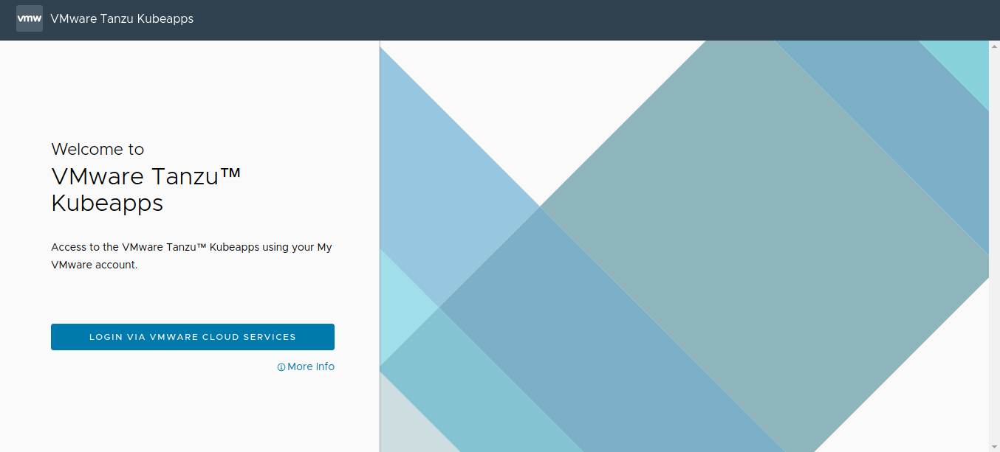
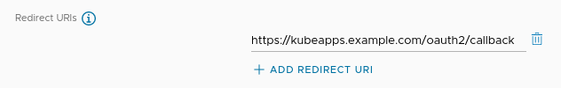
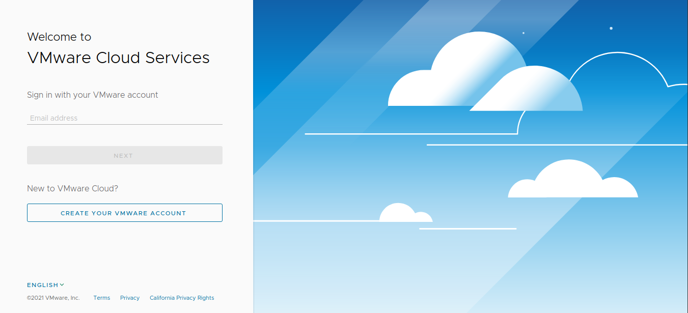

## Step 2: Configure and Install Kubeapps

Once the VMware Tanzu™ Kubernetes Grid™ cluster has been configured to work with Pinniped and the OIDC provider, the next step is to configure Kubeapps. This involves a number of tasks, including making Kubeapps proxy requests to Pinniped, enabling the OIDC login and, optionally, configuring the look and feel of the Kubeapps user interface.

Kubeapps is currently officially delivered as a Helm chart packaged by Bitnami. This Helm Chart offers a large number of configuration options in its [`values.yaml`](https://github.com/bitnami/charts/blob/master/bitnami/kubeapps/values.yaml) file. A general overview of the key configuration parameters for a TKG cluster is shown below:

```yaml
## Values likely to be modified

### Authentication-related parameters
clusters: # List of clusters that Kubeapps can target
authProxy: # Oauth2proxy configuration for setting up OIDC login
pinnipedProxy: # Pinniped-proxy configuration

### Look-and-feel-related parameters
dashboard: # Dashboard configuration
  customStyle: # Custom css to inject
  customComponents: # Custom components to inject
  customLocale: # Custom strings to inject

apprepository: # Apprepository controller configuration
  initialRepos: # Initial repositories to fetch
```

> **TIP**: Refer to the [Bitnami Kubeapps Helm chart documentation](https://github.com/bitnami/charts/blob/master/bitnami/kubeapps/README.md) for more information.

The two main configuration areas are authentication and user interface.

Key authentication parameters are:

- `clusters` to define the list of clusters that Kubeapps can target and which of them will use Pinniped;
- `pinnipedProxy` to enable the _Pinniped Proxy_ component;
- `authProxy`: to define the flags used by _OAuth2 Proxy_, the component for performing the actual OIDC login.

Key user interface parameters are:

- `dashboard.customStyle` for injecting custom CSS;
- `dashboard.customLocale` for customizing some supported strings;
- `apprepository.initialRepos` for defining the repositories included by default during the installation.

> **TIP**: These values can be entered in two different ways:
>
> - As values passed via command line:
>
> ```bash
> helm install kubeapps --namespace kubeapps --set ingress.enabled=true bitnami/kubeapps
> ```
>
> - As values stored in a custom `values.yaml` file read in during chart deployment:
>
> ```bash
> helm install kubeapps --namespace kubeapps -f custom-values.yaml  bitnami/kubeapps
> ```

### Step 2.1: Configure Authentication

The first step is to configure the `clusters`, `pinnipedProxy` and `authProxy` parameters to reflect the work done in [Step 1](./step-1.md). These parameters are discussed below:

1. Declare that the target cluster is using Pinniped by setting the parameter `pinnipedConfig.enabled=true`. If using multiple target clusters, please refer to the [Deploying to Multiple Clusters](https://github.com/vmware-tanzu/kubeapps/blob/main/site/content/docs/latest/howto/deploying-to-multiple-clusters.md) guide. Here is an example:

   > **TIP**: Since the target cluster is the same as the cluster on which Kubeapps is installed, there is no need to set a URL. Note that the `name` field is used only to configure a display name in the Kubeapps dashboard.

   ```yaml
   clusters:
     - name: my-tkg-cluster
       pinnipedConfig:
         enabled: true
   ```

2. Enable the _Pinniped Proxy_ component so that the requests performed by Kubeapps can be proxied through Pinniped, by setting the parameter `pinnipedProxy.enabled=true`. Here is an example:

   ```yaml
   pinnipedProxy:
     enabled: true
     defaultAuthenticatorName: kubeapps-jwt-authenticator # this name must match the authenticator name previously created
   ```

   > **TIP**: The `defaultAuthenticatorName` must match the _JWTAuthenticator_ resource name created in [Step 1](./step-1.md).

   > **NOTE**: Just if you are using the Pinniped version provided by TMC (instead of the one already provided by TKG), you also need to point to its namespace and API group suffix as follows. You can read more about it in the [chart documentation](https://github.com/bitnami/charts/blob/master/bitnami/kubeapps/README.md#pinniped-proxy-parameters).
   >
   > ```yaml
   > pinnipedProxy:
   >   # other options
   >   defaultPinnipedNamespace: vmware-system-tmc
   >   defaultPinnipedAPISuffix: pinniped.tmc.cloud.vmware.com
   > ```

3. Configure the _OAuth2Proxy_ component by entering the information gathered from the OIDC provider in [Step 1](./step-1.md). This component performs the authentication flow, generating the appropriate request to the login page and retrieving the token in the callback URL. Here is an example. Remember to replace the placeholders as follows:

   - Replace `CLIENT-ID` with the application ID obtained from the JSON file in the previous step.
   - Replace `CLIENT-SECRET` with the application secret obtained from the JSON file in the previous step.
   - Replace `COOKIE-SECRET` with a seed string for secure cookies (should be a 16-, 24-, or 32-byte string). Have a look at the [OAuth2Proxy documentation](https://oauth2-proxy.github.io/oauth2-proxy/docs/configuration/overview/#generating-a-cookie-secret) for additional information.
   - Replace the `OIDC-ISSUER-URL` with the issuer URL of the OIDC provider. For CSP it is `https://gaz.csp-vidm-prod.com`.
   - Replace the `OIDC-LOGIN-URL` with the login URL of the OIDC provider. For CSP it is `https://console.cloud.vmware.com/csp/gateway/discovery`.
   - Replace the `OIDC-REDEEM-URL` with the token redeem URL of the OIDC provider. For CSP it is `https://console.cloud.vmware.com/csp/gateway/am/api/auth/token`.
   - Replace the `OIDC-JWKS-URL` with the JSON Web Key Set URL of the OIDC provider. For CSP it is `https://console.cloud.vmware.com/csp/gateway/am/api/auth/token-public-key?format=jwks`.

> **TIP**: Remember that any OIDC-compliant provider should expose a `.well-known/openid-configuration` ([CSP example](https://console.cloud.vmware.com/csp/gateway/am/api/.well-known/openid-configuration)) where you will able to find the required endpoints in this step.

```yaml
authProxy:
  enabled: true
  provider: oidc
  clientID: CLIENT-ID
  clientSecret: CLIENT-SECRET
  cookieSecret: COOKIE-SECRET
  extraFlags:
    - --skip-oidc-discovery=true
    - --oidc-issuer-url=OIDC-ISSUER-URL # In CSP: https://gaz.csp-vidm-prod.com
    - --login-url=OIDC-LOGIN-URL # In CSP: https://console.cloud.vmware.com/csp/gateway/discovery
    - --redeem-url=OIDC-REDEEM-URL # In CSP: https://console.cloud.vmware.com/csp/gateway/am/api/auth/token
    - --oidc-jwks-url=OIDC-JWKS-URL # In CSP: https://console.cloud.vmware.com/csp/gateway/am/api/auth/token-public-key?format=jwks
```

> **TIP**: In some providers whose issuer URL does match the token URL, the flag `--skip-oidc-discovery=true` can be removed. Instead, just setting the `--oidc-issuer-url` flag will perform the automatic discovery of the rest of the endpoints. Further information at the [official OAuth2Proxy documentation](https://oauth2-proxy.github.io/oauth2-proxy/docs/configuration/overview/).

At this point, Kubeapps is configured to use Pinniped for authentication.

### Step 2.2: Configure the User Interface (optional)

The next step is to provide a rich user experience, aligned with corporate branding policies. This is achieved by configuring the `dashboard` and `apprepository` parameters. These parameters are discussed below:

1. Customize the interface strings and CSS rules with the `dashboard.customLocale` and `dashboard.customStyle` parameters. A simple example is to change the displayed application name (`Kubeapps`) and replace it with a different name, the corporate name/brand (`VMware Tanzu™ Kubeapps`). To do this, just set the `dashboard.customLocale` parameters to the custom strings. Here is an example of replacing `Kubeapps` with `VMware Tanzu™ Kubeapps`:

   ```yaml
   dashboard:
     customLocale:
       Kubeapps: VMware Tanzu™ Kubeapps
       login-desc-oidc: Access to the VMware Tanzu™ Kubeapps using your My VMware account.
       login-oidc: Login via VMware Cloud Services
   ```

   > **TIP**: See the [complete list of customizable strings](https://github.com/vmware-tanzu/kubeapps/blob/main/dashboard/lang/en.json).

   In a similar manner, add custom style rules using custom CSS selectors. For example, to change the Kubeapps logo, set the selector `.kubeapps-logo` to the property `background-image: url('data:image/png;base64...')` as shown in the example below. The long string shown is the Base64-encoded data for the new logo image.

   ```yaml
   dashboard:
     customStyle: |-
       .kubeapps-logo {
       background-image: url('data:image/png;base64,iVBORw0KGgoAAAANSUhEUgAAAQQAAAA4CAYAAAAbx4ZoAAANHklEQVR4Xu2debT11RjHv9+wDBWiWZQsU5Q0a6JEVCoqc4MVKhkbaFAkxJJSISoZKskQQoZKiJQkkamMlaESFVKUx/qctfddv/f3nnvO79z3vuuee3r2P/ftd/ZvD9/neb7PsPc5WdkSgUQgESgIOJFIBBKBRKAikISQupAIJAJTCCQhpDIkAolAEkLqQCKQCCyMQEYIqRWJQCKQEULqQCKQCGSEkDqQCCQCAxDIlCHVIxFIBDJlSB1IBBKBDilDRCwhaTlJS0m61xyCdqukm2z/bw7XkFMnAvcoBBZKGSJi5UIG4wDErbZvGIeF5BoSgXsCAv0I4TFjtPG7bf9mjNaTS0kEJhqBcScE2b56oiWQm0sExgiBJIQxEkYuJRGYawSSEOZaAjl/IjBGCCQhjJEwcimJwFwjkIQw1xLI+ROBMUIgCWGMhJFLSQTmGoEkhLmWQM6fCIwRAkkIYySMXEoiMNcIJCHMtQRy/kRgjBCYGEKIiFdIereklW3f0Q/jiHiEpN9J2tL2tyPirZJeI2k12/+Y5p0XSPqUpMfb/uUYyW7gUiKCtT52QKfLba83H/YTESFpM9vfba43Ik6W9BxJG9i+tuteIuLXkt5sG7lmayAwSYSwpKQ/YeC2PzGNcR8paRfbj+PzQghvkXSQbchkgRYR4HOlpDXnISE8RRKY0B4u6VRJz5f09/LsNts/mA/W0I8QImJ/SW+XtIXtS0bZRxLC9GhNRwhLS/qApMskndB6fXdJT5eER+Uz/r5a0sMk/VHSOyVtKOm5khinPuPzQyRhrOeXMfHO65d3qvd9lyS+6XgUfUa5uhwRH5S0tu2N+xj3vSX9QdLRto9tEcJNJUq4veWBdpT0+fJsXkUIrX1AgL+QtJLtv4xiPOPQt00IEbGdpC9I2tX2maOuMQlhdELYQNJp5bUti1Hzn1sVomiOeJukBzYetP+bjzAqFBJCuL4QCmTxw/Ienx/UGr8X7o5ICGsVj76W7Z+2jAKC+iTEZftvDULYRtKjJR1p+5jWO6zvZknPrBFCRHxY0kNs71L7FgU9W9Lytm8pY0O2fFOTiOWsiGAMiBNs7yPp++UzUpheq4oq6QGS8IDn2D64fAbJ4RF5/1+SzpJ0sG3+PbBFxLSEEBEPlfRaSTtJeqSk6yRBrCfYJlRnXadIulsSofY+kpYtzmKfKp+I+JgknEW7XWp7o4g4WtIqtl/Ywvhrkr5lG0fQtzUJISKI1r4n6RjbpHxTrescDZwfLOkA0kxJV6CfpJKtMQfi3hG/l5KiFCeJM0KGdxZ9PLSmuBHRqV+RCbq0X1k73/fBgX/U9n+G6cOgzwelDN8sXv/9jSihPvt4iQJQNCIAjJmogEXSiADog4JAIpAE3pb3aTtgYJKqEvA5kQKEwTu8vy8dRyGEAhSG9iPbvfdriwgU70bbuzWeoVCbSiI33QuDaAgHovgS9QYUtkEIz5aEV1rW9l1lTgzmZZJ2s31GecZ+UFz63RYRr8K2JF1U/rI+SGKNKsSiqL+XdP9SD8GYbogIIrIvF6FDBCjyEZL+anv7YQowhBD47QvG+lypr6wh6UOSDrdNmlEJAcJg7jcWZUZ2PTnavjMiHlV+R6MuhzQFAt7P9gldjbXfXiohSLpGEmnOxbZf1O7bdY6CM46J39ogjUT/XllkSAqC3Nj3UNwjogt+GPp7Jf0Z8rX9nYIX0fIttrct83XtR90E+6JuxreB10X3JG1vm+h6xm0QIeBREXr16M3ogGIUXgSmq4TR9Pi7FsE138Hjf1ESJMI7/OXz2jAQCIHUAoLpheozIIQ9JB1Xios97xkReD682+ZV2OV5JQS8PYZIoamXIkXExSXFeEMRZC9liIj7YoiStrF9UflBGQT9GUkr1MghIg6XtIntradRcn6IhuhgX9sYe40QSME2bJAEMsIDfNr2oQ0yIyrDQHZmHYM0YBAhTLO2l0vauxYdS4QAcU2lYhFBlEP6AQl+pUW+7O1C0knbhPfsbVEjBHSFCOlJRba9SKw1b6c5CiH8l7GaHjUiTpe0qu3NSv1oRrhHRBs/DJ2I+1m2v96Q4YqSfkth1PYFJULo0o90es2K7Yytv8+LgwgBA0eo/K3hPEKp4T0LbxICw/+qzFEJoZl6QAh4f4ye9IEIgcZ4kE/zGYTTq/rPgBDwrhQXD7D9kaKM1DUAnXBzqpWi4qa2t4oI+rBuPN3mkr4hiRQE48fgp2oIEYHxX2P7kIggwoCtN5NEHWS54jGJVE6zDXFiEE+VRAETDwyLXy5pI0nH235fgxCOq6RUnj1REukPpyeso7l+quw320Y+07YhEQLpCevaWdL9CjHiBLa2TSQylTLYJopqzk+N6VTbJ7aeEx4TEWFw1GdmgxB+VuZ4kKRz22sZZY5CCKe005QiI3SeOVbtgntEdMEPQsAJLlPTsIpXRHxV0lW2DyyE0KUfTgYSRv7sA12alTbslIGiH2lA01hrTWEmhID3r2kDGyA1wCMTOdQ2lS7wYFRCKIpBhLCx7fWLJ+NI6h22Abup0L0IoRACeTFRArn7i0s4vlNEwOJtQkDAhMLrFM9n2/tHBAbCmJDBjaVQeX1EPLk8ew+eXhIeFEKEhE6qitmv2BURkPB5JUxvC52fuDvbNkejMyUE1gNJHVi81QqlnrCXbQiiEsJdtvdu4Ud1//QmrhEByZGHb2u7Fo9ngxCQAWOTipDC7VHTs4ZxjRIhHGG71sl6Q0TE6iUE5y+OYSjuEdEFP/TlbbYZd4EWEaQNYXv3QghD+5W1blHSt2eU6PdA26S4i9SGEUIzDagGXHPzmRACY9T3+HdNDWptovmst7EZEgIKjkcht0IIeHA87AL5VTNCKCBjsIR7eMZ1bF8xDSEsUwqG3GsgXN+z5IWHFYVlP0QovXP+iKDgQ+TAsV+TkDCY84cQAnu5qtRo+t2VICynjjMyIUTE8mUfT7D984ZhEfWwrpEIISJIYyjOfdb2m1p75Vh39WYxtmBDCH1hh6LiDrbPKe+gN0Qh6zXvhkREpzk6RAjsA9kOxF0SaQeF42H4QQgnlQiBYmJTB9CfSxoRwtB+rfcpCkPUOCLqHwvc1RiVHYYRAuPVQh//rqlA07DxchgcraYMFJsIn2vKgMISWdBqbQLlph+f1UiEZzDflOLPhBCK0gA0kQ31g2tt79kGpw8h4B3J6y+wTeEGY14oQijPMXpCNWoWK9q+OyLIb1FwPMvVtilYMQYnE3fYfl3D6KhFELkcO4gQyvuQ28k1tWiMsUSXH6GdLmWIiJVKesWpSb2fwHqpmxw1A0IgB+cn+KidYCxNxeckA+IEo16LCCIccugTOxDC1MWkkt8Taq9SLiX1josjotMchRAwTI6op9ZZvDWFZdI/xhuI+wj41RoC++8Vasv4pIM/LulZs4YwrN/S7Yt0peZ1hm2cz4xbF0JgcHJ/jKt5kYXwn7D30oYB1yLhVKhYCofkpM1bfpACRFDHIxJ5Xp85ZhQhFLBfUnIsvNxG/S7htAmhvEc+f6Zt9jWIEDBuIgqEwAlDFTJpB8dYeK+flDEorEGaFJUuiwjyU9IXLg9xL6J32jLd+XhE0A8DqOkVKQenHVTa1x129DikhsDRKsT2ekkcWZF+QPKQXOcIISLAm/CXdKv5O5i3E31EBPqCDuDZUVqiMHLgp3GiMgohFKyo7mNM59mGlMGv0xwFZ/SP/VKoxAHhMKjaN08ZhuIeEV3wgxDAlEIohHBBKapz8kD9gBMt1t+1H+//UxKOhrs1m+BYip4vcNw+KjN0JYRRx521/osQIeCBEfp1tsnhF2rTEMKSTQMbECGsVqKJHW1P1UAiAqPdzjaRyVSLCMI6zrxJN4hCiB6IjAamDA2iWZs6SCleclxGaIghDTxhKIo26B4C5HR8OX79dznePLecaoxCCBzr9jtRudI2a0fh8bwoLlEETgIihEA630NoYUrxl0iNekctIA+do3EPgXCbmhFRIDdSuYdAUbEpt4G4F3Ifhl+9X0C+j35wnMkJGFenuUsC7pUQIMxh/XA4RO4cOUOMnIYcVlOqRTG+iSWERQEl300EZhOBeuGoXpmfbuyu/WZzbe2xkhAWJ7o5diLQ8PxJCLOgDjNNGWZh6hwiEZgVBLp6/q79ZmVR0wySEcLiRDfHTgTmGQJJCPNMYLncRGBxIpCEsDjRzbETgXmGQBLCPBNYLjcRWJwIJCEsTnRz7ERgniGQhDDPBJbLTQQWJwLjTgj5v4NfnNLPsROBFgL9CIFrkUuNCVK38otBY7KWXEYiMPEI9CMEvjjD3W5+aIRvo81V46vKN3X5Nt9cLTDnTQQmDYGFCGHSNpj7SQQSge4IJCF0xyp7JgITj0ASwsSLODeYCHRHIAmhO1bZMxGYeASSECZexLnBRKA7AkkI3bHKnonAxCOQhDDxIs4NJgLdEUhC6I5V9kwEJh6BJISJF3FuMBHojkASQnessmciMPEI/B8l0gSinyDqvwAAAABJRU5ErkJggg==') !important;
       width: 21.6em !important;
       height: 4.2em !important;
       }
   ```

   This image depicts a customized version of Kubeapps applying the above styles and strings:

   

2. Customize the initial application repositories by setting the `apprepository` parameter. Here is a simple example of adding the Bitnami open source catalog:

   ```yaml
   apprepository:
     initialRepos:
       - name: bitnami
         url: https://charts.bitnami.com/bitnami
   ```

At this point, Kubeapps is configured to use a custom interface.

### Step 2.3: Install Kubeapps

With the configuration out of the way, it's time to install Kubeapps. Since Kubeapps is currently officially delivered as a [Helm chart packaged by Bitnami](https://github.com/bitnami/charts/tree/master/bitnami/kubeapps), the easiest way to install Kubeapps is to add the Bitnami repository to Helm and install it via Helm.

In case Kubeapps is to be installed in an air-gapped environment, please follow the [offline installation instructions](https://github.com/vmware-tanzu/kubeapps/blob/main/site/content/docs/latest/howto/offline-installation.md) instead.

> **TIP**: Typically, the Kubeapps dashboard is set as externally accessible, either by setting the parameter `frontend.service.type=LoadBalancer` (as shown below) or by using an Ingress controller. Please refer to [the Kubeapps documentation covering external access](https://github.com/vmware-tanzu/kubeapps/blob/main/chart/kubeapps/README.md#exposing-externally) for additional information.
>
> ```yaml
> frontend:
>   service:
>     type: LoadBalancer
> ```

Use the commands below to install Kubeapps. The final command assumes that the Kubeapps chart configuration parameters are defined in a file named `custom-values.yaml`, so ensure this file exists before running that command.

```bash
# Install the Bitnami helm repository
helm repo add bitnami https://charts.bitnami.com/bitnami

# Create a 'kubeapps' namespace in our cluster
kubectl create namespace kubeapps

# Install a 'kubeapps' release in the 'kubeapps' namespace with the values defined at 'custom-values.yaml'
helm install kubeapps --namespace kubeapps bitnami/kubeapps -f custom-values.yaml
```

Finally, remember to replace the placeholder _Redirect URIs_ you entered when [creating the OAuth2 application during step 1](./step-1.md#create-an-oauth2-application) with the actual value.

For instance, assuming Kubeapps is accessible at `https://kubeapps.example.com` replace `https://localhost/oauth2/callback` with `https://kubeapps.example.com/oauth2/callback`.

> **TIP**: If you are serving Kubeapps from a subpath, for instance, `https://example.com/kubeapps`, you will need to slightly modify the `authProxy` configuration. Please follow [these instructions](https://github.com/vmware-tanzu/kubeapps/blob/main/chart/kubeapps/README.md#serving-kubeapps-in-a-subpath) for further details.



At this point, Kubeapps is installed in the cluster and the OIDC provider is fully configured.

### Step 2.4: Configure Role-Based Access

Once Kubeapps is installed, the next step is to configure access. Since Kubeapps delegates authorization to the existing Role-Based Access Control (RBAC) configured in the cluster, every permission should be granted using `ClusterRoleBinding` and `RoleBinding` objects. Please refer to the official documentation about [Kubeapps access control](https://github.com/vmware-tanzu/kubeapps/blob/main/site/content/docs/latest/howto/access-control.md) for more information.

> **NOTE**: RBAC configuration depends on your custom business requirements. The configuration shown below is only an example and not meant for production use. Please refer to the official [Kubernetes RBAC documentation](https://kubernetes.io/docs/reference/access-authn-authz/rbac/) for more details.

The configuration shown below demonstrates how to create a `ClusterRoleBinding` named `kubeapps-operator` with the `cluster-admin` role for a specified user. Replace the `EMAIL-ADDRESS` placeholder with the email address for the user, as specified in the OIDC provider and name the file `kubeapps-rbac.yaml`.

```yaml
---
kind: ClusterRoleBinding
apiVersion: rbac.authorization.k8s.io/v1
metadata:
  name: kubeapps-operator
roleRef:
  apiGroup: rbac.authorization.k8s.io
  kind: ClusterRole
  name: cluster-admin
subjects:
  - apiGroup: rbac.authorization.k8s.io
    kind: User
    name: EMAIL-ADDRESS
```

Apply this configuration by running the following command:

```bash
kubectl apply -f kubeapps-rbac.yaml
```

At this point, the user having `EMAIL-ADDRESS` email account will have `cluster-admin` access and will be able to perform any desired action via the `kubectl` CLI or the Kubeapps dashboard.

### Step 2.5: Log in to Kubeapps with OIDC

Once Kubeapps is installed and configured, the next step is to log in and access the Kubeapps Web dashboard. The procedure to do this depends on how Kubeapps was configured.

1. If [the service was exposed externally](https://github.com/vmware-tanzu/kubeapps/blob/main/chart/kubeapps/README.md#exposing-externally), it may be accessed using a public IP address; if not, it can be accessed locally by forwarding the cluster port using the command below:

   ```bash
   kubectl port-forward -n kubeapps svc/kubeapps 8080:80
   ```

   This will start an HTTP proxy for secure access to the Kubeapps dashboard.

2. Browse to [http://127.0.0.1:8080](http://127.0.0.1:8080) (when forwarding the port) or to the public IP address of the serevice (when exposing the service externally). You see the Kubeapps login page, as shown below:

   

3. Click the _Login_ button. You are redirected to the OIDC provider (in this example, the VMware Cloud Services Portal).

   

4. Enter the necessary credentials. If the login is successful, you are redirected to the Kubeapps dashboard:

   

At the end of this step, the Kubeapps installation is configured, customized and running in the cluster. The next step is to [add application repositories to Kubeapps](./step-3.md).
