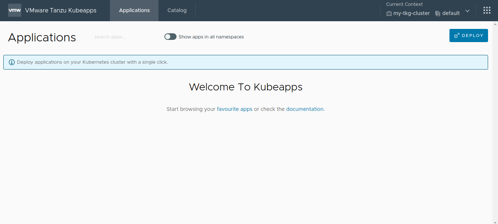
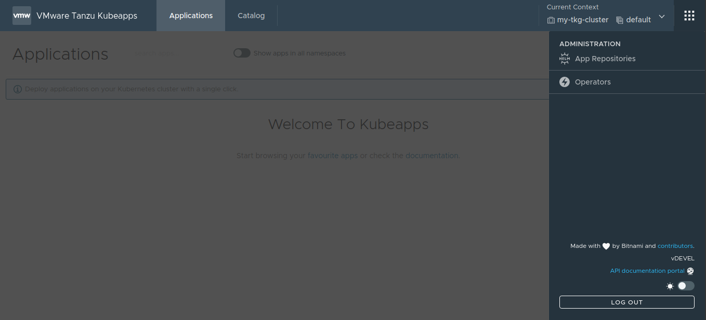
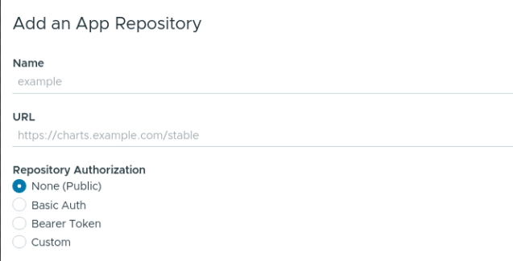
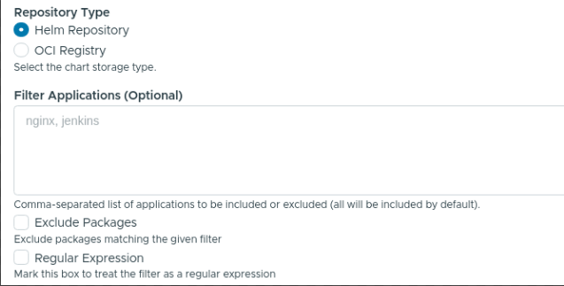
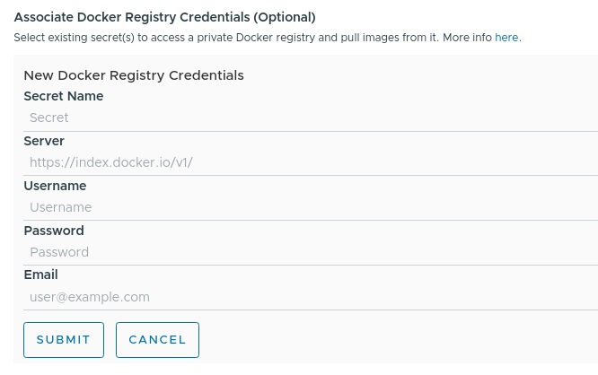
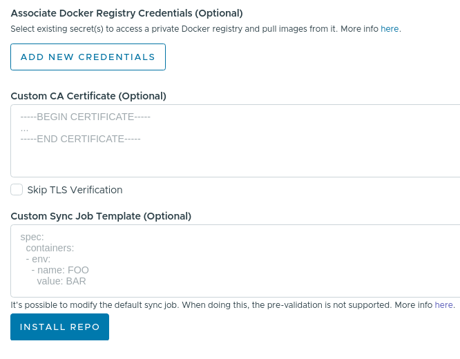
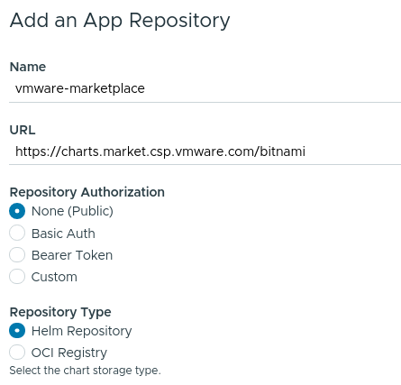
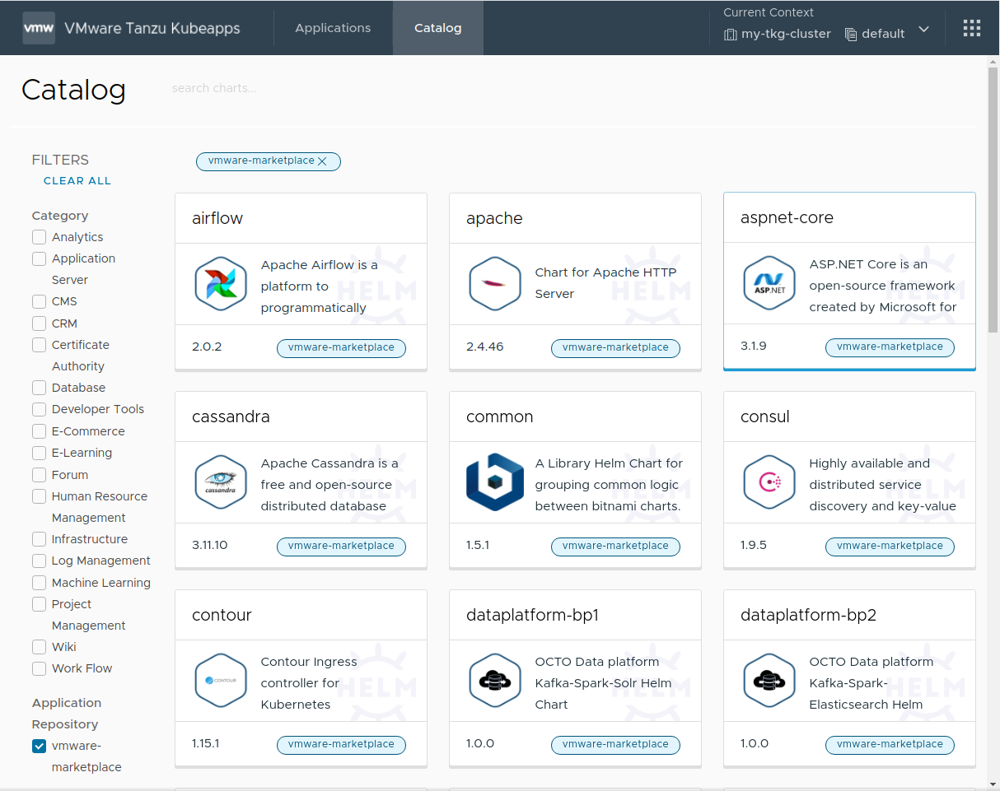
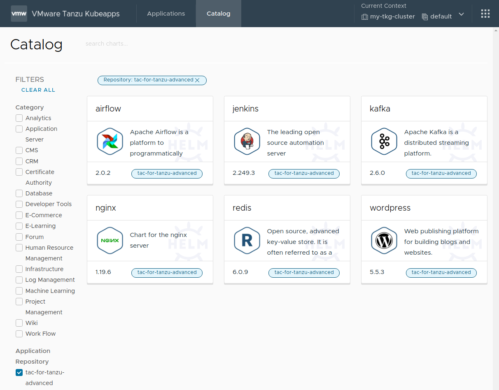

## Step 3: Add Application Repositories to Kubeapps

Once Kubeapps is up and running on the VMware Tanzu™ Kubernetes Grid™ cluster, the next step is to add application repositories to it. This could include public repositories, private repositories or both.

The general procedure to add any repository is described below:

1. Log in to Kubeapps as described in the previous step.
2. Click the menu button in the top right corner (dotted square).

   

3. Click the _Package Repositories_ button.

   

4. Add a new repository by clicking the _Add Package Repository_ button.

> **NOTE**: If no repositories were specified in the `initialRepos` chart parameter during the Kubeapps installation, no repositories will be shown on the _Application Repositories_ page.

5. Fill the _Add a Package Repository_ form using the guidelines below:

- The _Name_ field is a friendly display name for the repository.
- The _URL_ field specifies the endpoint of the repository. This endpoint might require different forms of authentication, such as `None`, `Basic Auth` (username and password), `Bearer Token` (a token) or another `Custom` mechanism.

  

- The _Repository Type_ field specifies the type of repository. Currently, Kubeapps supports both Helm repositories and OCI registries. For the latter, it is necessary to also manually specify the list of artifacts to fetch in the _List of Repositories_ field (as there is no index yet). Additionally, artifacts can be excluded using regular expressions if required.

  

- The _Associate Docker Registry_ field specifies an `imagePullSecret` for images that are to be pulled from the private registry. It is possible to create a fresh secret or choose an existing one.

  

- The _Custom CA Certificate_ field specifies a CA certificate to use (with an option to skip the TLS verification if required).
- The _Custom Sync Job_ field specifies the synchronization template to use when periodically pulling the latest changes from the application repository.

  

6. Click the _Install Repo_ button to finish the process and add the repository to Kubeapps.

Retrieving the catalog from the repository will take a few minutes. Once complete, the contents of the repository will become available in Kubeapps. To check the progress of the synchronization task, use the following command, replacing REPOSITORY-NAME with the name configured above:

```bash
kubectl logs -n kubeapps -l apprepositories.kubeapps.com/repo-name=REPOSITORY-NAME
```

The following sections demonstrate the process of filling the _Add a Package Repository_ form for two specific examples: the VMware Marketplace™ and the VMware Tanzu™ Application Catalog™ for Tanzu™ Advanced.

### Add the VMware Marketplace™

> **NOTE**: This repository is currently under heavy development. Therefore, the URL used below is subject to change.

The public content from the VMware Marketplace™ repository can be retrieved at `https://charts.market.csp.vmware.com/bitnami`. Since this is a public repository, it is only necessary to configure the following values in the _Add a Package Repository_ form:

- _Name_: Add a descriptive name, such as `vmware-marketplace`.
- _URL_: Use the endpoint URL `https://charts.market.csp.vmware.com/bitnami`.



Once complete, the public catalog will be visible in Kubeapps, as shown below:



### Add the VMware Tanzu™ Application Catalog™ for Tanzu™ Advanced

The private content from the VMware Tanzu™ Application Catalog™ for Tanzu™ Advanced repository can be retrieved at `https://registry.pivotal.io/tac-for-tanzu-advanced/charts/`. Since this is a private OCI registry, there are two key differences to note in the process:

- It is necessary to specify repository authentication credentials using the `Basic Auth` option and defining the correct username and password. If you do not have these credentials, please reach out to your [VMware sales representative](https://www.vmware.com/company/contact_sales.html).
- As this is an OCI registry, it is necessary to manually add the list of artifacts to be retrieved in the _List of Repositories_ field.

Configure the following values in the _Add Repository_ form:

- _Name_: Add a descriptive name, such as `tac-for-tanzu-advanced`.
- _URL_: Use the endpoint URL `https://registry.pivotal.io/tac-for-tanzu-advanced/charts/`.
- _Repository Authorization_: Set the value to `Basic Auth`.
  - Enter your VMware Tanzu™ Application Catalog™ for Tanzu™ Advanced username and token in the _Username_ and _Password_ fields respectively.
- _Repository Type_: Set the value to `OCI Registry`.
- _List of Repositories_: Set the value to `kibana, kiam, mariadb, postgresql-ha, grafana-operator, nginx-ingress-controller, mongodb, minio, nginx, apache, ejbca, mongodb, elasticsearch, etcd, solr, kubewatch, tomcat, kong, rabbitmq, grafana, logstash, jenkins, postgresql, redis, kube-state-metrics, airflow, mariadb-galera, contour, influxdb, cassandra, wavefront, nats, aspnet-core, wordpress, tensorflow-resnet, spring-cloud-dataflow, fluentd, zookeeper, kafka, node-exporter, memcached, redis, parse, keycloak, external-dns, pytorch, mxnet, harbor, thanos, spark, consul, kubeapps, mysql, wildfly, metrics-server`.
- _Associate Docker Registry Credentials_:
  - _Secret Name_: Set the value to `tac-for-tanzu-advanced`.
  - _Server_: Set the value to `https://registry.pivotal.io/tac-for-tanzu-advanced/`.
  - _Username_: Set the value to your VMware Tanzu™ Application Catalog™ for Tanzu™ Advanced username.
  - _Password_: Set the value to your VMware Tanzu™ Application Catalog™ for Tanzu™ Advanced token.
  - Click _Submit_ to create and save the secret.

Once the secret has been created, it will appear in the list of _Associate Docker Registry Credentials_. Tick the checkbox for this newly-created `tac-for-tanzu-advanced` registry credential.


> **NOTE**: To obtain the most current list of repositories, log in to the registry using the `oras` tool and run the command below:
>
> ```bash
> oras pull registry.pivotal.io/tac-for-tanzu-advanced/index:latest -a && cat asset-index.json | jq -r '.charts | map(.name) | join(",")'
> ```

Once complete, the private catalog will be visible in Kubeapps, as shown below:



At the end of this step, the Kubeapps installation is configured with one or more application repositories. The next step is to [start using Kubeapps](./step-4.md).

## Appendix: Role-Based Access Control (RBAC) in Application Repositories

A Kubeapps application repository can be created by anyone with the required RBAC privileges for that namespace.

Users with cluster-wide RBAC privileges for creating application repositories can still create an application repository whose charts will be available to users in all namespaces by selecting `All Namespaces` when creating the repository.

To grant a user permission to create `AppRepository` objects in a specific namespace, create `RoleBinding` objects associating `apprepositories-read` and `apprepositories-write` roles with that user, as shown below. Replace the `USERNAME` and `CUSTOM-NAMESPACE` placeholders with the corresponding username and namespace name.

> **TIP**: If users only require permissions to deploy charts from application repositories in a specific namespace, it is sufficient to create only the `apprepositories-read` `RoleBinding` object.

```bash
# Grant the user USERNAME read apprepositories permissions on the CUSTOM-NAMESPACE namespace
kubectl -n CUSTOM-NAMESPACE create rolebinding USERNAME-apprepositories-read \
    --user USERNAME
    --clusterrole kubeapps:$KUBEAPPS_NAMESPACE:apprepositories-read
```

```bash
# Grant the user USERNAME write apprepositories permissions on the CUSTOM-NAMESPACE namespace
kubectl -n CUSTOM-NAMESPACE create rolebinding USERNAME-apprepositories-write \
    --user USERNAME \
    --clusterrole kubeapps:$KUBEAPPS_NAMESPACE:apprepositories-write
```
