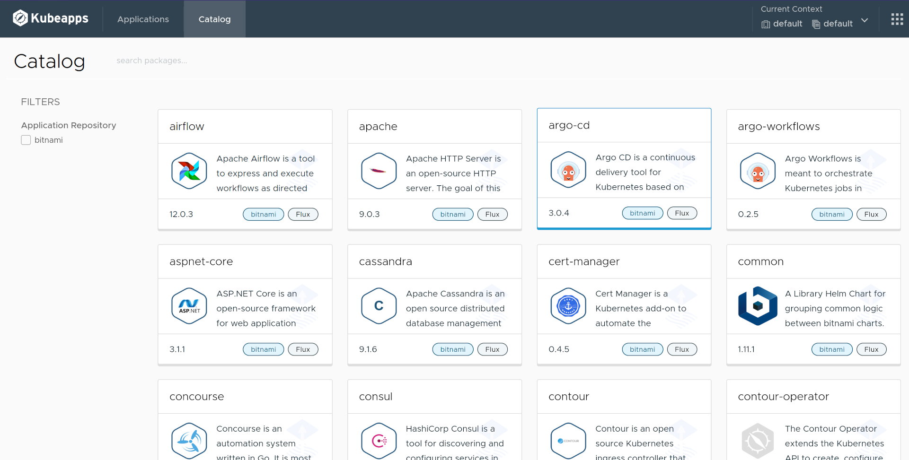
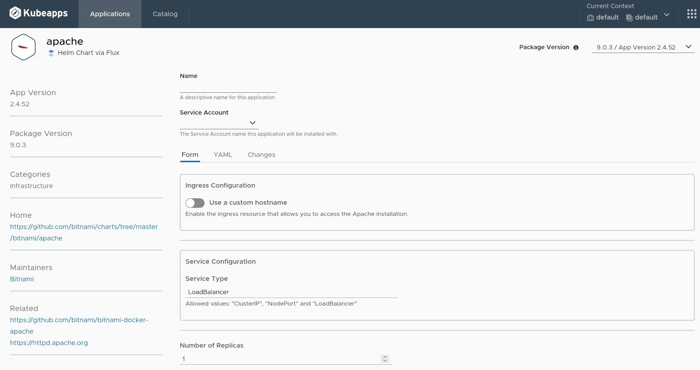
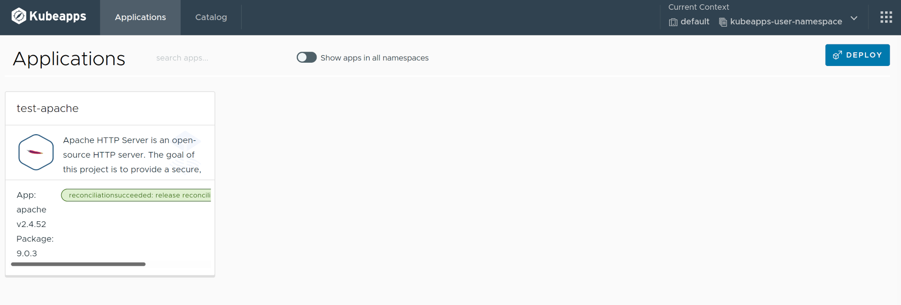
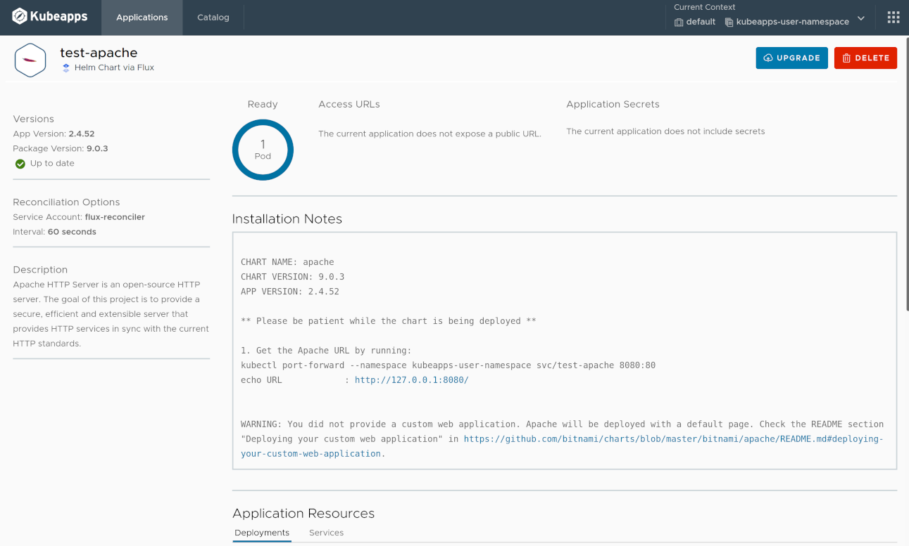

# Managing Flux V2 Packages with Kubeapps

> **NOTE**: This guide is about a feature that is under active development and, therefore, not yet ready for production use. The information herein stated is subject to change without notice until we reach a stable release.

## Table of Contents

1. [Introduction](#introduction)
2. [Installing Flux in your Cluster](#installing-the-flux-controllers-in-your-cluster)
   1. [Quick overview of the Flux CRs](#quick-overview-of-the-relevant-flux-custom-resources)
3. [Using Kubeapps for Managing Flux Packages](#using-kubeapps-to-manage-flux-helm-releases)
   1. [Configuring Kubeapps to Support Flux Packages](#configuring-kubeapps-to-support-flux-helm-releases)
   2. [Installing a Package Repository](#installing-a-helm-repository)
   3. [Installing a Package](#installing-a-package)
   4. [Viewing the Installed Applications](#viewing-the-installed-packages)
4. [Conclusions](#conclusions)

---

## Introduction

Historically, Kubeapps was initially developed to solely manage [Helm Charts](https://helm.sh) on your Kubernetes clusters. However, it has evolved to support multiple formats, such as [Carvel Packages](https://carvel.dev/kapp-controller/docs/latest/packaging/#package) and [Helm releases via Fluxv2](https://fluxcd.io/docs/guides/helmreleases/).

> **TIP**: Find more information about the architectural evolution at [this video](https://www.youtube.com/watch?v=rS2AhcIPQEs) and [this technical documentation](../reference/developer/kubeapps-apis.md).

[Flux](https://fluxcd.io/) is a set of continuous and progressive delivery solutions for Kubernetes that are open and extensible. In particular, the Flux helm-controller allows you to [manage Helm chart releases](https://fluxcd.io/docs/guides/helmreleases/) declaratively with Kubernetes manifests. Similarly, the [Flux HelmRepository](https://fluxcd.io/docs/guides/helmreleases/#helm-repository) can be used to manage Helm repositories declaratively.

This guide walks you through the process of using Kubeapps for configuring and deploying Helm charts via Flux.

## Installing the Flux controllers in your Cluster

> **NOTE**: This section can safely be skipped if you already have Flux installed in your cluster.

In order to manage Flux Helm releases in Kubeapps, you will first need to install the Flux controllers in your cluster.

In most situations, people use Flux to declare all their resources in a Git branch which Flux then reconciles on the cluster, but Flux also supports HelmRelease and `HelmRepository` custom resources. Refer to the [Flux installation instructions](https://fluxcd.io/docs/installation/) for general installation instructions. If you simply want to test the Kubeapps Flux support, you can install the flux components without any Git branch or even the Flux CLI with a [dev install](https://fluxcd.io/docs/installation/#dev-install):

```bash
kubectl apply -f https://github.com/fluxcd/flux2/releases/latest/download/install.yaml
```

After running this command, you should have everything you need to try out Kubeapps' Flux support. You can check on the progress of the Flux installation with:

```bash
kubectl --namespace flux-system get pod
```

### Quick overview of the relevant Flux Custom Resources

The two custom resources that are relevant for our Kubeapps integration are:

- [HelmRepository](https://fluxcd.io/docs/guides/helmreleases/#helm-repository) stores a reference to a traditional Helm repository and fetches the repository index on an interval, similar to Kubeapps' built-in `AppRepository` resource.
- [HelmRelease](https://fluxcd.io/docs/guides/helmreleases/#define-a-helm-release) defines the intended state of a Helm release, supporting a multitude of features, the most important of which for our purposes is a semver version option, so that the Flux reconciliation process will always ensure that the latest matching version is installed.

## Using Kubeapps to manage Flux Helm releases

### Configuring Kubeapps to support Flux Helm releases

As with any other packaging format, the Flux support is enabled in Kubeapps by means of a plugin.

To enable the Flux packaging support, in the [values.yaml](https://github.com/vmware-tanzu/kubeapps/blob/main/chart/kubeapps/values.yaml) file, edit the `packaging` option as follows:

```yaml
packaging:
  helm:
    enabled: false
  flux:
    enabled: true
```

> **TIP**: Please refer to the [getting started documentation](./getting-started.md) for more information on how to install Kubeapps and pass custom configuration values.

> **NOTE**: You cannot run Kubeapps currently with both the Helm and Flux packaging support, since they both operate on Helm releases.

### Installing a Helm Repository

> **NOTE**: Currently, Kubeapps does not offer any graphical way to manage [Flux Helm Repositories](https://fluxcd.io/docs/guides/helmreleases/#helm-repository). Therefore, you will need to install the helm repository manually.

As an example, you can create the manifest for a Flux `HelmRepository` referring to the Bitnami Helm chart repository with:

```bash
cat > repo.yaml << EOF
---
apiVersion: source.toolkit.fluxcd.io/v1beta1
kind: HelmRepository
metadata:
  name: bitnami
  namespace: default
spec:
  url: https://charts.bitnami.com/bitnami
  interval: 10m
EOF
```

and apply it with:

```bash
kubectl apply -f repo.yaml
```

This creates the Flux `HelmRepository` in the `default` namespace that will sync the Bitnami chart index every ten minutes. Any user who can read `HelmRepository` resources in the default namespace will be able to create `HelmRelease` resources referring to charts in this repository in any namespace to which they have sufficient RBAC.

### Creating a service account

Since the Flux system reconciles a `HelmRelease` in the background, we need to create a service account to use when creating a Helm release via Flux. This service account is created in the namespace where you intend to install the package (specifically, where the `HelmRelease` resource will be created).

```bash
cat > kubeapps-user-service-account.yaml << EOF
---
apiVersion: v1
kind: ServiceAccount
metadata:
  name: flux-reconciler
  namespace: kubeapps-user-namespace
automountServiceAccountToken: false
---
apiVersion: rbac.authorization.k8s.io/v1
kind: RoleBinding
metadata:
  name: flux-reconciler
  namespace: default
subjects:
- kind: ServiceAccount
  name: flux-reconciler
  namespace: kubeapps-user-namespace
roleRef:
  kind: ClusterRole
  name: admin
  apiGroup: rbac.authorization.k8s.io
EOF

kubectl apply -f kubeapps-user-service-account.yaml
```

Note that this service account will have `admin` access to the namespace only and so will be able to read/write most resources in the namespace, including adding other roles and rolebindings. If your package includes cluster-wide resources such as CRDs or ClusterRoles, you will need to update the above to use a ClusterRoleBinding with a different cluster role, such as cluster-admin. See [Kubernetes user-facing roles](https://kubernetes.io/docs/reference/access-authn-authz/rbac/#user-facing-roles) for more info about the roles.

### Installing a Package

Installing a Flux Package in Kubeapps is very similar to installing any other package (such as a Helm Chart) in Kubeapps.

> **TIP**: Please refer to the [user documentation](../howto/dashboard.md) for more information on how to use Kubeapps as a user.

Assuming that a Flux `HelmRepository`, such as the Bitnami repository above, is already installed in the cluster, you can simply go to the `Catalog` tab and select the package you want to install.

The following image depicts the catalog page with a set of packages from the above Bitnami `HelmRepository`.



Next, select any package you want to install, for example, `Apache`, then click Deploy to see the install form as depicted below:



A big difference with respect to other packaging formats is that **you must select a `ServiceAccount` to be used for installing the package**. This is because Flux, similar to [Carvel](managing-carvel-packages.md), will carry out the installation as well as upgrades in the background and so cannot rely on doing so as the user. See [Creating a service account](#creating-a-service-account) above.

In Kubeapps, a dropdown will allow you to select which `ServiceAccount` you want to use, such as the `flux-reconciler` service account created above.

> **NOTE**: As a consequence, the user logged in Kubeapps will need RBAC permissions to perform a `list` operation on `ServiceAccount` objects.

> **TIP**: For the Apache package, ensure that the ServiceType is set to an option supported by your cluster. For instance, for a local Kind cluster, you will want to choose `ClusterIP` rather than `LoadBalancer`.

Finally, after clicking the `Install` button, the Flux `HelmRelease` be installed in the cluster. At this moment, Flux will perform the required actions to deploy the related Helm chart and its related resources. This process is known as _reconciliation_. You can check the CLI for more details about the reconciliation:

```bash
kubectl -n kubeapps-user-namespace get helmrelease
NAME          READY     STATUS                       AGE
test-apache   Unknown   Reconciliation in progress   8s
```

### Viewing the Installed Packages

Viewing the installed Flux Packages in Kubeapps is the same experience as viewing any other installed package (such as a Helm Chart) in Kubeapps.

> **TIP**: Please refer to the [user documentation](../howto/dashboard.md) for more information on how to use Kubeapps as a user.

Go to the `Applications` tab to see every Application that has been installed in the cluster. Click on _show apps in all namespaces_ to view the ones currently installed in every namespace of the cluster.

The following example shows an example of the Applications page with Apache installed as a Flux package:



Since the reconciliation process can eventually fail for several reasons, this page will show the current reconciliation status of each application.

Next, click on the application you want to view, for example, `test-apache` to go to the details page, as depicted in the following image:



As in any other packaging format, this page will display those Kubernetes resources that have been created as a result of the Package installation.
Besides, the current values are shown at the end of the page.

Next, you can click on the `Delete` button to uninstall the application or the `Upgrade` button to edit the values of the application or update it to another version.

> **NOTE**: as opposed to Helm Charts, Flux Packages cannot be rolled back, hence there is no `Rollback` button.

Finally, note that every Flux Package installed through Kubeapps can also be managed by `kubectl` or the [flux](https://fluxcd.io/docs/cmd/) CLI using the `flux get helmrelease` command. For example:

```bash
flux get -n kubeapps-user-namespace helmrelease test-apache
NAME            READY   MESSAGE                                 REVISION        SUSPENDED
test-apache     True    Release reconciliation succeeded        9.0.3           False
```

## Conclusions

This guide has covered how to manage Flux Packages in Kubeapps, starting from [how to configure Kubeapps itself](#configuring-kubeapps-to-support-flux-helm-releases), then how to [add Helm Package Repositories](#installing-a-helm-repository) for Flux, next [how to browse and install Flux Packages](#installing-a-package), and finally [how to view the installed Flux Packages](#viewing-the-installed-packages).

Some additional resources and references include:

- [Getting Started with Flux](https://fluxcd.io/docs/get-started/)

Finally, we are [currently working](https://github.com/vmware-tanzu/kubeapps/milestone/17) on this Flux plugin for managing Flux Packages, so if you encounter any problems, please [file an issue](https://github.com/vmware-tanzu/kubeapps/issues/new) in the Kubeapps repository.
